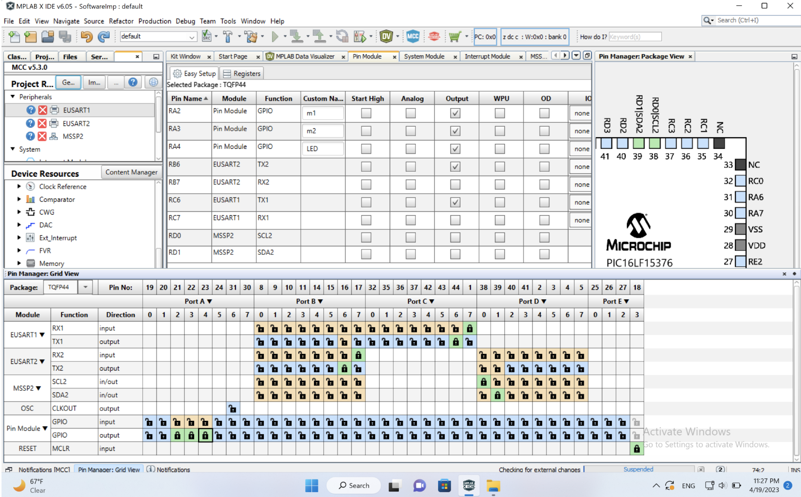

# **9.0 Appendix**

## **<u>Table 12. Communication Channels</u>**

| **Name**         | **First Choice Communication** | **Second Choice Communication** | **Third Choice Communication** |
|------------------|--------------------------------|---------------------------------|--------------------------------|
| Fatema Alshehhi  | *Discord*                      | *WhatsApp*                      | *Messages*                     |
| Salsabil Soliman | *Discord*                      | *WhatsApp*                      | *Messages*                     |

## **Communication Procedures**

> Communication between group members will take place on Discord. Thus,
> the team will regularly meet and discuss any updates and plan their
> assignments outline and goals. Moreover, the team will email the
> professor as a communication method with the instructor for guidance
> and inquiries. Zoom/Discord meetings will also be held for updates or
> quick weekday meetups.

## **Meeting Schedule**

Our team availability can be found through this
[link](https://docs.google.com/spreadsheets/u/1/d/1qsL_EHei7h-eo-5rombT-5g8ybxEDRhG_eKkYWFzCa4/edit). Initially, we are planning to meet Fridays from 3:00 PM until 5:00 PM.
However, our team will try to discuss and work all the main agenda
through the class time. Additionally, we will hold zoom/Discord meetings
on weekdays to discuss any updates and plan in-person meetings.

**Meeting Coordination**

-   We are going to remind each other by the meetings through discord.

-   The meeting time is based on the [schedule of availabilit](https://docs.google.com/spreadsheets/u/1/d/1qsL_EHei7h-eo-5rombT-5g8ybxEDRhG_eKkYWFzCa4/edit) and discussions at least a week before.

-   Our preferred meeting methode is online through discord/zoom if no in-person work is required.

-   Team members need to notify the team if there were any changes to
    their availability schedule to ensure that we are all attending
     the meetings on time.

## **Team Coordination**

-   We set an earlier due date which ranges between 4-24 hours before
     the actual due date and make sure that every team member is
     checked off by the time that we set it.

-   We will ask every team member about their knowledge and what part do
     they think they can do the best based on previous semesters
     projects or any projects that they did before.

-   The assignments will be reviewed and validated by each team member
     before submission to ensure that we have everything as it should
     be.

## **<u>Table 13.Roles and Responsibilities</u>** 

<table>
<colgroup>
<col style="width: 15%" />
<col style="width: 15%" />
<col style="width: 69%" />
</colgroup>
<thead>
<tr class="header">
<th><strong>Role</strong></th>
<th></th>
<th><strong>Duties</strong></th>
</tr>
<tr class="odd">
<th>
Meeting leader and

Meeting recorder
</th>
<th>Salsabil Soliman</th>
<th>
Schedules team meetings, creates and distributes an agenda for each meeting, and runs each meeting

And

Takes minutes of each team meeting, including attendance, and records action items and to whom they are assigned
</th>
</tr>
<tr class="header">
<th>Project monitor and Assignment leader</th>
<th>Fatema</th>
<th>
Tracks the team’s progress relative to the project schedule (Gantt chart) and keeps team members apprised of deadlines and project status

And

Coordinates the team's work on a given assignment to Canvas before the due date
</th>
</tr>
</thead>
<tbody>
</tbody>
</table>

## **How will you assign technical responsibilities to the team members?**

Responsibilities will be discussed among the team members and strengths
will be noted. If no member is strong in an area required by the
project, a team member will be assigned that duty with the expectation
of help from other team members. They will be expected to learn enough
about the responsibility to perform it through the semester.

## **User Needs List**

1.  The product should be easy to use/ user friendly

2.  The product should work on multi dirt levels areas not just light

3.  The cleaning area should be bigger/wider

4.  Would be better if it need replacement after working for a longer
     time

5.  The product worked on a high dirt level surface

6.  Improving user-robot interaction experience

7.  Cleaning product/water spray

8.  Can be used frequently

9.  Efficient/functional design

10. Can shut itself down to save power

11. Nice Display and design

12. Efficient and long-lasting product

13. Good electrical and mechanical build

14. the cleaning area should be bigger/wider

15. Smart technology/algorithm for user need and interaction

16. Improving user-robot interaction experience

17. The robot need to be able to act by itself

18. The robot left no stains after cleaning

19. Easy to maintain

20. Should be able to map out the area and create consistent pathways

21. Easy to use

22. Works on multiple layers

23. Follows set patterns

24. Can be manually operated

25. Can automatically restart programmed sequence

26. Ability to control the working time

27. Competitive price

28. Should be able to process data correctly as it should

29. Efficient battery life

30. The robot need to be able to act by itself

31. Does not need to be watched

32. Can work for longer periods of time

33. Cleans heavy build-up

34. Can reach high places safely

35. Can recharge itself

36. Does not break easily

37. Can be used in smaller areas

38. Long-lasting

39. Wireless

40. Finishes work quickly

41. Need longer battery life

42. Efficient battery use

43. Control the space in where it is working

44. Knows how to process data and act when unusual object was on the way

45. Ability to control the working time

46. Cost efficient

47. Solid balance

48. Does not corrupt/damage the surface

49. Doesn't lose power quickly

50. Have to work on different environment/surface

51. Can work under any pressure of work given

52. Feedback to the user like showing battery remaining

53. Does not waste user's time and meets the purpose that it was made
     for

54. Sustainable

55. Uses fewer resources

56. Easy to set up

57. Can process data correctly as it should

58. Does not have Programming errors

59. Efficient work

60. The ability to do daily work

61. Should have a camera installed

62. have an emergency shutdown option

63. The ability of manual/remote troubleshooting

64. Can be both manually/self controlled

65. should be able to move from solar panel to another

66. should know its way back to the charging station

67. should be able to know when to charge itself

68. should be able to know how long it runs on a certain charge

69. should be able to calculate the efficiency according to the sensor
     data such as wind speed and humidity

70. should be able to operate in different area size

71. should give daily-weekly reports to the user to collect data

72. should be able to store the data collected

73. is safe to use

74. use the energy generated by the solar panels to recharge

75. know when is the best time to start/stop working

76. easy to move from one place to another

77. can operate by itself for a long time periods

78. needs lees human supervision

79. the ability to deal with different weather conditions

80. should have a good electrical isolation for safety purposes

81. must be waterproof

82. the user should be able to track the robot

83. Good price with good quality

84. Long-lasting Materials

85. Works under worst circumstances and has good features

86. Should not miss areas and be able to clean the entire surface

87. The cleaning patterns should be improved/smarter

88. The prices should be reasonable for the technology and services it
    provides

89. Should be able to move in any direction needed

90. Should use a reliable materials

91. Should be able to operate efficiently in various conditions

92. easy to maintain

93. Should be able to identify and mark the edges of the area

94. It does not need regular maintenance

95. The algorithm/coding need to be fixed as it gets stuck/confused
     against simple linear surfaces/ should be able to clearly identify
     the path

96. It does the job accurately and takes actions fast

97. Good set up process

98. Good instructions and make it as simple as possible

99. It should states how to be used in different environment with good
     instructions

100. Customer services that is aware of common issues between users to
      answer questions or common questions answered on the instruction
     paper

101. It should have high sensing and accurately does it job

102. Easy to use and understand

## **Our Team Milestones**

Concept presentation: 1/23/2023

Design presentation: 2/22/2023

Design freeze: 3/24/2023

Planned release: 4/28/2023

---
## **Bill of Materials** 

| **Bill of Materials Team 301**  |                   |                         |                          |                          |                           |                                   |                         |                                                                                                                                                                                                                                                                                                                                       |                                                                                                                       |              |                      |             |                                     |
|---------------------------------|-------------------|-------------------------|--------------------------|--------------------------|---------------------------|-----------------------------------|-------------------------|---------------------------------------------------------------------------------------------------------------------------------------------------------------------------------------------------------------------------------------------------------------------------------------------------------------------------------------|-----------------------------------------------------------------------------------------------------------------------|--------------|----------------------|-------------|-------------------------------------|
| **Part Name/Description**       | **Unit Quantity** | **Unit Prototype Cost** | **Total Prototype Cost** | **Unit Production Cost** | **Total Production Cost** | **Manufacturer**                  | **Manufacturer Part #** | **Vendor Link**                                                                                                                                                                                                                                                                                                                       | **Datasheet Link**                                                                                                    | **Supplier** | **Supplier Part #**  | **Surplus** | **Schematic Reference Designators** |
| FAN8100N/Motor driver           | 8                 | $0.00                   | $0.00                    | $0.73                    | $5.84                     | Fairchild Semiconductor           | FAN8100N                | [<u>Link</u>](https://www.digikey.com/en/products/detail/rochester-electronics-llc/FAN8100N/11558200)                                                                                                                                                                                                                                 | [<u>Link</u>](https://rocelec.widen.net/view/pdf/1pizbjqffm/FAIRS23777-1.pdf?t.download=true&u=5oefqw)                | Digikey      | 2156-FAN8100N-FS-ND  | 0           | U6                                  |
| Motor                           | 4                 | $0.00                   | $0.00                    | $6.89                    | $27.56                    | JYC International Trade Co., Ltd. | DC3-12V 00933           | [<u>Link</u>](https://www.amazon.com/AUTOTOOLHOME-Torque-Traxxas-Wheels-Electric/dp/B01M58POHF/ref=asc_df_B01M58POHF/?tag=hyprod-20&linkCode=df0&hvadid=309768150198&hvpos=&hvnetw=g&hvrand=9707710327954434611&hvpone=&hvptwo=&hvqmt=&hvdev=c&hvdvcmdl=&hvlocint=&hvlocphy=9030039&hvtargid=pla-526501699343&psc=1&region_id=972485) | No datasheet                                                                                                          | Amazon       | B01M58POHF           | 0           | TP24-25                             |
| Temp Sensor TC74                | 6                 |                         | $0.00                    | $1.90                    | $11.40                    | Microchip                         | SOT-23                  | [<u>Link</u>](https://www.microchip.com/en-us/product/TC74)                                                                                                                                                                                                                                                                           | [<u>Link</u>](https://ww1.microchip.com/downloads/aemDocuments/documents/APID/ProductDocuments/DataSheets/21462D.pdf) | Microchip    | TC74                 | 0           | U5                                  |
| Micro Controller                | 3                 |                         | $0.00                    | $1.85                    | $5.55                     | Microchip Technology              | PIC16LF15376            | [<u>Link</u>](https://www.digikey.com/en/products/detail/microchip-technology/PIC16LF15376-I-PT/7164824)                                                                                                                                                                                                                              | [<u>Link</u>](https://ww1.microchip.com/downloads/en/DeviceDoc/PIC16_L_F15313_23_Data_Sheet_40001897C.pdf)            | Digikey      | PIC16LF15376-I/PT-ND | 0           | U11                                 |
| Switching regulator AP63203WU-7 | 5                 | $0.00                   | $0.00                    | $1.16                    | $5.80                     | Diodes Incorporated               | AP63203WU-7             | [<u>link</u>](http://digikey.com/en/products/detail/diodes-incorporated/AP63203WU-7/9858426)                                                                                                                                                                                                                                          | [<u>link</u>](https://www.diodes.com/assets/Datasheets/AP63200-AP63201-AP63203-AP63205.pdf)                           | Digikey      | AP63203WU-7DICT-ND   | 0           | U2                                  |

## **MQTT table** 

| EGR314/Team301/Temperature sensor |                                           |     |     |     |     |     |
|-----------------------------------|-------------------------------------------|-----|-----|-----|-----|-----|
| Entities Publishing               | MQTT                                      |     |     |     |     |     |
| Entities Subscribing              | Microcontroller                           |     |     |     |     |     |
| Topic Value Separator             | NA/only sending one value                 |     |     |     |     |     |
| Value 1                           |                                           |     |     |     |     |     |
| Value Name:                       | Temperature                               |     |     |     |     |     |
| Value Description:                | Temperature reading value                 |     |     |     |     |     |
| Unit System:                      | Celsius                                   |     |     |     |     |     |
| Value Minimum:                    | Zero - 0                                  |     |     |     |     |     |
| Value Maximum:                    | 1024                                      |     |     |     |     |     |
| Value Type:                       | Float                                     |     |     |     |     |     |
| Value Format String:              | printf ("temp = %uF \\n", readtemp,temp); |     |     |     |     |     |
| Value Unique Identifier:          | C                                         |     |     |     |     |     |
| Full Topic Example:               | printf ("temp = %uF \\n", readtemp,temp); |     |     |     |     |     |

## 

## **MPLAB Project Code**

/\*\*

Generated Main Source File

Company:

Microchip Technology Inc.

File Name:

main.c

Summary:

This is the main file generated using PIC10 / PIC12 / PIC16 / PIC18 MCUs

Description:

This header file provides implementations for driver APIs for all
modules selected in the GUI.

Generation Information :

Product Revision : PIC10 / PIC12 / PIC16 / PIC18 MCUs - 1.81.8

Device : PIC16LF15376

Driver Version : 2.00

\*/

/\*

\(c\) 2018 Microchip Technology Inc. and its subsidiaries.

Subject to your compliance with these terms, you may use Microchip
software and any

derivatives exclusively with Microchip products. It is your
responsibility to comply with third party

license terms applicable to your use of third party software (including
open source software) that

may accompany Microchip software.

THIS SOFTWARE IS SUPPLIED BY MICROCHIP "AS IS". NO WARRANTIES, WHETHER

EXPRESS, IMPLIED OR STATUTORY, APPLY TO THIS SOFTWARE, INCLUDING ANY

IMPLIED WARRANTIES OF NON-INFRINGEMENT, MERCHANTABILITY, AND FITNESS

FOR A PARTICULAR PURPOSE.

IN NO EVENT WILL MICROCHIP BE LIABLE FOR ANY INDIRECT, SPECIAL,
PUNITIVE,

INCIDENTAL OR CONSEQUENTIAL LOSS, DAMAGE, COST OR EXPENSE OF ANY KIND

WHATSOEVER RELATED TO THE SOFTWARE, HOWEVER CAUSED, EVEN IF MICROCHIP

HAS BEEN ADVISED OF THE POSSIBILITY OR THE DAMAGES ARE FORESEEABLE. TO

THE FULLEST EXTENT ALLOWED BY LAW, MICROCHIP'S TOTAL LIABILITY ON ALL

CLAIMS IN ANY WAY RELATED TO THIS SOFTWARE WILL NOT EXCEED THE AMOUNT

OF FEES, IF ANY, THAT YOU HAVE PAID DIRECTLY TO MICROCHIP FOR THIS

SOFTWARE.

\*/

#include "mcc_generated_files/mcc.h"

#include "mcc_generated_files/examples/i2c2_master_example.h"

#include \<xc.h>

#include \<stdint.h>

#define address 0b1001100

#define tempreg 0x00

volatile uint8_t rx1;

volatile uint8_t rx2;

//process messages eusart communication between the pic and the sp32

void EUSART2_ISR(void)

{

    EUSART2_Receive_ISR();

    

    if(EUSART2_is_rx_ready()){

        

        rx1 = EUSART2_Read(); // read data from eusart 2 and place in
rx1

    

        while (!EUSART1_is_tx_ready());

        EUSART1_Write(rx1); // print rx1 data in eusart 1

        while (!EUSART1_is_tx_done()){};

    }

}

void EUSART1_ISR(void)

{

    EUSART1_Receive_ISR();

    

    if(EUSART1_is_rx_ready()){

        

        rx2 = EUSART1_Read(); // read data from eusart 1 and place in
rx2

    

        while (!EUSART2_is_tx_ready());

        EUSART2_Write(rx2); // print rx2 data in eusart 2

        while (!EUSART2_is_tx_done()){};

 

        LED_0\_Toggle();

    

    }

}

/\*

Main application

\*/

void main(void)

{

// initialize the device

SYSTEM_Initialize();

// When using interrupts, you need to set the Global and Peripheral
Interrupt Enable bits

// Use the following macros to:

// Enable the Global Interrupts

INTERRUPT_GlobalInterruptEnable();

// Enable the Peripheral Interrupts

INTERRUPT_PeripheralInterruptEnable();

// Disable the Global Interrupts

//INTERRUPT_GlobalInterruptDisable();

// Disable the Peripheral Interrupts

//INTERRUPT_PeripheralInterruptDisable();

SYSTEM_Initialize();

I2C2_Initialize();

EUSART1_Initialize();

uint8_t readtemp;

uint8_t temp;

while (1)

{

readtemp = I2C2_Read1ByteRegister(address, tempreg); //reading the temp
data from the sensor

temp = (readtemp\*1.8)+32; // calculating temp in degree C

if(-10\<=temp\<=100) { //check if the value make sense/PID

if(EUSART1_is_tx_ready())

{

readtemp = I2C2_Read1ByteRegister(address, tempreg);

temp = (readtemp\*1.8)+32;

printf ("temp = %uF \\n", readtemp,temp);

\_\_delay_ms(1000);

}

if (temp \<= 25){ // check if the temp is less than or equal to 25
degree C

RA2_SetHigh(); //turn the motor1 CW on

\_\_delay_ms(10000); //wait for 10 sec

RA2_SetLow(); // turn the motor1 off

\_\_delay_ms(10000); //wait for 10 sec

RA3_SetHigh(); //turn the motor2 CCW on

\_\_delay_ms(10000); //wait for 10 sec

RA3_SetLow(); // turn the motor2 off

if(EUSART1_is_tx_ready())

{

printf ("Cleaning is Done for Today"); // displaying "Cleaning is Done
for Today"

\_\_delay_ms(43200000); //wait for 12 hours

}

}

}

}

}

/\*\*

End of File

\*/

## **MCC Configuration**

</figure>
<figure class="image">  

  

   

</figure>

</figure>
<figure class="image">  

  

   

</figure>
