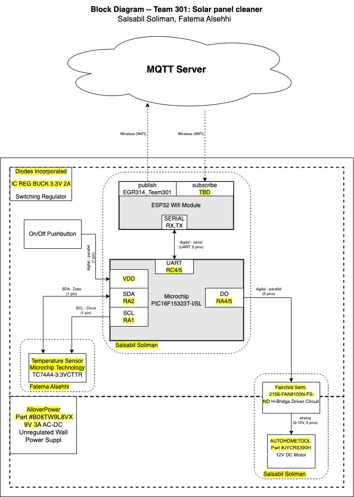

# **4.0 Block Diagram**

The electrical system receives an unregulated 9V DC input from Part
*#B08TW9L8VX AC-DC* wall power supply. The 9V input is regulated to 3.3V
using the switching regulator *IC REG* *BUCK 3.3V 2A*. The regulated
output then powers the Microchip *PIC16F15323T-I/SL* microcontroller,
which controls the motors through the *FAN8100N-FS-ND* H-Bridge Driver
through pins RA4/5. The temperature sensor *TC74A4-3.3V* is connected to
the microcontroller using i2c serial communication through pins RA1 and
RA2 which are the SDA and SCL pins. The microcontroller receives data
from the temperature sensor and uses it to control the motors. The block
diagram of the electrical system would show the power supply at the top,
followed by the microcontroller, motors driver, motors, and temperature sensor.
The connections between the components would be indicated by arrows.

<figure class="image">  

  

   

Figure 13 - Block Diagram  

</figure>

