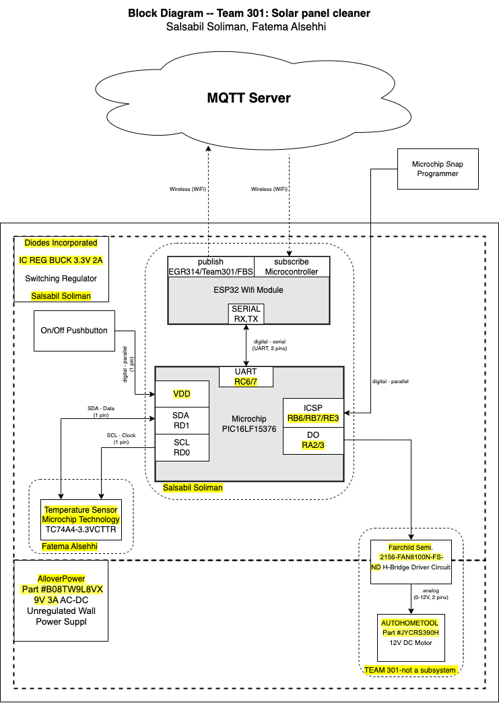

# **4.0 Block Diagram**

In order to develop the block diagram for the electrical system, the team first identified the components that were needed to meet the product requirements. The process involved selecting components that could receive the input from the temperature sensor and control the motors efficiently. The microcontroller PIC16LF15376 was chosen for its small size, low power consumption, and built-in temperature sensor interface. The team also chose the temperature sensor TC74A4-3.3V for its accuracy and low power consumption. The motor driver was selected for its ability to drive the motors with enough power while also being small enough to fit in the final design.

The block diagram was then developed to illustrate the connections between the different components of the system. The power supply was placed at the top of the diagram since it is the initial source of power. The regulated output was connected to the microcontroller which is the brain of the system. The temperature sensor was then connected to the microcontroller using the I2C serial communication protocol. The microcontroller was then connected to the motor driver which controlled the motors. The arrows were used to indicate the flow of information and power between the components.

Overall, the block diagram was designed to meet the product requirements and ensure that the components were connected in an efficient and effective manner.

<figure class="image">  

  

   

Figure 13 - Block Diagram  

</figure>

