# **5.0 Major Component Selections**

-   Temperature Sensor

<table>
<colgroup>
<col style="width: 33%" />
<col style="width: 33%" />
<col style="width: 33%" />
</colgroup>
<thead>
<tr class="header">
<th><strong>Solution</strong></th>
<th><strong>Pros</strong></th>
<th><strong>Cons</strong></th>
</tr>
<tr class="odd">
<th>
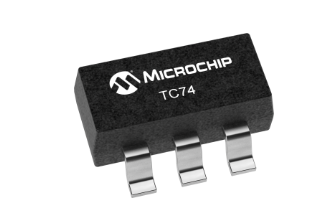

Temperature Sensor Digital.

Part <strong>No.</strong>

TC74A4-3.3VCTTR

<strong>Price</strong>: 1.09$

<a href="https://www.digikey.com/en/products/detail/microchip-technology/TC74A4-3-3VCTTR/443268"><u>Link</u></a>
</th>
<th><ul>
<li><blockquote>

It’s digital

</blockquote></li>
<li><blockquote>

Well manufactured

</blockquote></li>
<li><blockquote>

Famous in the industry

</blockquote></li>
</ul></th>
<th><ul>
<li><blockquote>

Limited temperature range

</blockquote></li>
<li><blockquote>

It can heat itself

</blockquote></li>
<li><blockquote>

Hard to find

</blockquote></li>
</ul></th>
</tr>
<tr class="header">
<th>
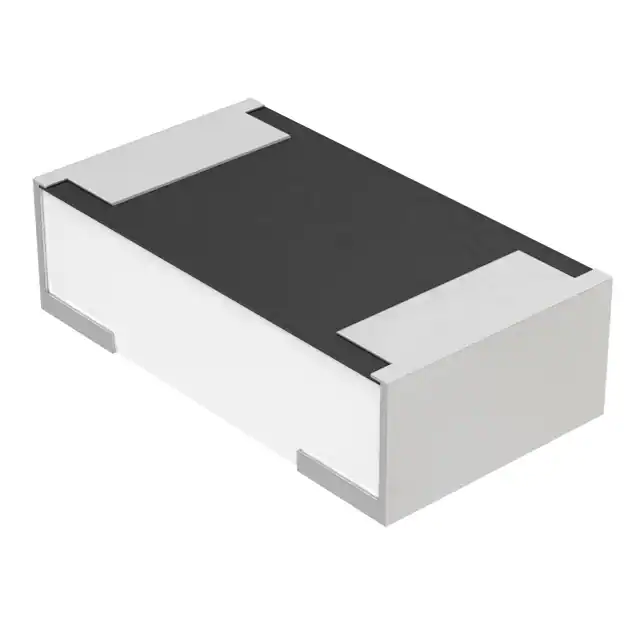

100 Ohms RTD Platinum

Part <strong>No.</strong>

749-1056-2-ND

<strong>Price</strong>: 2.56$

<a href="https://www.digikey.com/en/products/detail/vishay-beyschlag-draloric-bc-components/PTS0603M1B100RP100/5977838"><u>Link</u></a>
</th>
<th><ul>
<li><blockquote>

Fast response

</blockquote></li>
<li><blockquote>

Low voltage

</blockquote></li>
<li><blockquote>

Affordable

</blockquote></li>
</ul></th>
<th><ul>
<li><blockquote>

High sensitivity

</blockquote></li>
<li><blockquote>

Large coefficient of resistance

</blockquote></li>
<li><blockquote>

It’s unknown capacity of heat

</blockquote></li>
</ul></th>
</tr>
<tr class="odd">
<th>
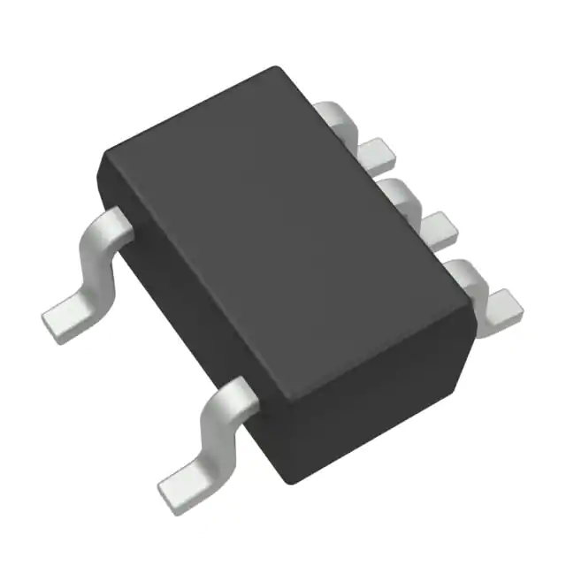

Temperature Sensor Analog

Part <strong>No.</strong> 296-TMP236A4DCKTT-ND

<strong>Price</strong>: 1.24$

<a href="https://www.digikey.com/en/products/detail/texas-instruments/TMP236A4DCKT/9692559"><u>Link</u></a>
</th>
<th><ul>
<li><blockquote>

It is analog

</blockquote></li>
<li><blockquote>

Good voltage range

</blockquote></li>
<li><blockquote>

Affordable

</blockquote></li>
</ul></th>
<th><ul>
<li><blockquote>

It needs ADC to turn it into digital

</blockquote></li>
<li><blockquote>

It’s Accuracy level is not good enough

</blockquote></li>
<li><blockquote>

Its needs more testing

</blockquote></li>
</ul></th>
</tr>
</thead>
<tbody>
</tbody>
</table>

<figure class="image">  

  

   

</figure>

**Choice:** 1st Option.

**Rationale:** The first solution is the perfect choice for our project;
because of its functionality and digital output. Moreover, it is
frequently used in industry and it was recommended by the instructor.

-   Motors

<table>
<colgroup>
<col style="width: 33%" />
<col style="width: 33%" />
<col style="width: 33%" />
</colgroup>
<thead>
<tr class="header">
<th><strong>Solution</strong></th>
<th><strong>Pros</strong></th>
<th><strong>Cons</strong></th>
</tr>
<tr class="odd">
<th>
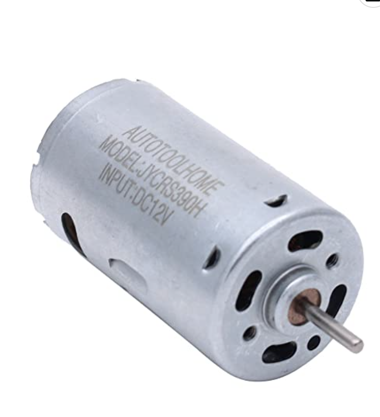

Mini DC Motor High Torque Part <strong>No.</strong>

B01M58POHF

<strong>Price</strong>: 6$

<a href="https://www.amazon.com/AUTOTOOLHOME-Torque-Traxxas-Wheels-Electric/dp/B01M58POHF/ref=asc_df_B01M58POHF/?tag=hyprod-20&amp;linkCode=df0&amp;hvadid=309768150198&amp;hvpos=&amp;hvnetw=g&amp;hvrand=9707710327954434611&amp;hvpone=&amp;hvptwo=&amp;hvqmt=&amp;hvdev=c&amp;hvdvcmdl=&amp;hvlocint=&amp;hvlocphy=9030039&amp;hvtargid=pla-526501699343&amp;psc=1&amp;region_id=972485"><u>Link</u></a>
</th>
<th><ul>
<li><blockquote>

Have a wide range of voltage

</blockquote></li>
<li><blockquote>

Not expensive

</blockquote></li>
<li><blockquote>

Run on low current .24A

</blockquote></li>
</ul></th>
<th><ul>
<li><blockquote>

Sold by amazon

</blockquote></li>
<li><blockquote>

Require a motor driver

</blockquote></li>
<li><blockquote>

Bearings wearing out quickly

</blockquote></li>
</ul></th>
</tr>
<tr class="header">
<th>
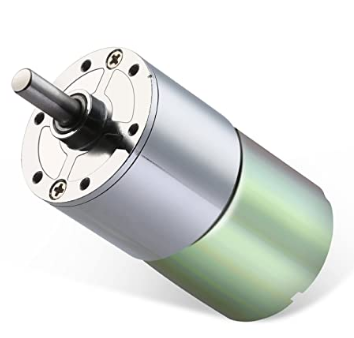

DC-12V-550 RPM Motor

Part <strong>No.</strong>

Greartisan

<strong>Price</strong>: 14.9$

<a href="https://www.amazon.com/dp/B072R5G5GR/ref=sspa_dk_detail_0?pd_rd_i=B072R5G5GR&amp;pd_rd_w=9QlSN&amp;content-id=amzn1.sym.46bad5f6-1f0a-4167-9a8b-c8a82fa48a54&amp;pf_rd_p=46bad5f6-1f0a-4167-9a8b-c8a82fa48a54&amp;pf_rd_r=KGC3HCZ0W92G622A4WGB&amp;pd_rd_wg=kAivu&amp;pd_rd_r=a5ba4536-3a9c-4d9b-9b05-c72407cce6f6&amp;s=industrial&amp;sp_csd=d2lkZ2V0TmFtZT1zcF9kZXRhaWw&amp;spLa=ZW5jcnlwdGVkUXVhbGlmaWVyPUExVlhXTFdKOFRSUzlCJmVuY3J5cHRlZElkPUEwNzE3MjUxMkRZUlk1MzlSVEJEViZlbmNyeXB0ZWRBZElkPUEwNTAwNzg2VEc2VEFYNkVUQzJPJndpZGdldE5hbWU9c3BfZGV0YWlsJmFjdGlvbj1jbGlja1JlZGlyZWN0JmRvTm90TG9nQ2xpY2s9dHJ1ZQ&amp;th=1"><u>Link</u></a>
</th>
<th><ul>
<li><blockquote>

Good/higher quality

</blockquote></li>
<li><blockquote>

Can generate up to 550 rpm

</blockquote></li>
<li><blockquote>

Run at low current of 0.5 A

</blockquote></li>
</ul></th>
<th><ul>
<li><blockquote>

More expensive

</blockquote></li>
<li><blockquote>

Sold by amazon

</blockquote></li>
<li><blockquote>

No shaft encoder

</blockquote></li>
</ul></th>
</tr>
<tr class="odd">
<th>
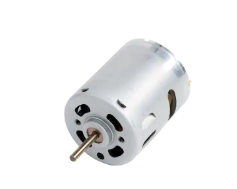

Low voltage DC motor

Part <strong>No</strong>.

HC385G-302

<strong>Price</strong>: 6.7$

<a href="https://www.digikey.com/en/products/detail/johnson-motor/HC385G-302/12723725?utm_adgroup=Motors%20-%20AC%2C%20DC&amp;utm_source=google&amp;utm_medium=cpc&amp;utm_campaign=Shopping_Product_Motors%2C%20Solenoids%2C%20Driver%20Boards%2FModules_NEW&amp;utm_term=&amp;utm_content=Motors%20-%20AC%2C%20DC&amp;gclid=CjwKCAiAuOieBhAIEiwAgjCvch5cwdnsUAqDaYU8i62zM4vnEvOeKLOOEFvlMCM89TmzsTfB_mCdYRoCVo0QAvD_BwE"><u>Link</u></a>
</th>
<th><ul>
<li><blockquote>

Can provide up to 3900 rpm

</blockquote></li>
<li><blockquote>

Lowest price

</blockquote></li>
<li><blockquote>

Smaller than the other options

</blockquote></li>
</ul></th>
<th><ul>
<li><blockquote>

Datasheet link is not correct in the digi-key website

</blockquote></li>
<li><blockquote>

The website doesn't have enough information

</blockquote></li>
<li><blockquote>

The range of operating voltage is unknown

</blockquote></li>
</ul></th>
</tr>
</thead>
<tbody>
</tbody>
</table>

<figure class="image">  

  

   

</figure>

**Choice:** 1st Option.

**Rationale:** I worked with that motor before and it was easy to use
and has a very low operation voltage which is 5v. It produces enough
torque as needed and the price is not too high. That is why this is our
chosen option.

-   Motor driver

<table>
<colgroup>
<col style="width: 33%" />
<col style="width: 33%" />
<col style="width: 33%" />
</colgroup>
<thead>
<tr class="header">
<th><strong>Solution</strong></th>
<th><strong>Pros</strong></th>
<th><strong>Cons</strong></th>
</tr>
<tr class="odd">
<th>
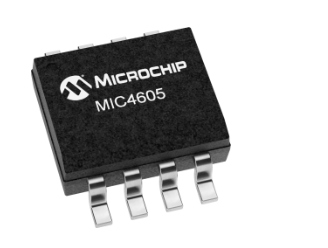

85V Half Bridge MOSFET Drive

Part <strong>No.</strong>

MIC4605-2YM-TR

<strong>Price:</strong> 0.99$/each

<a href="https://www.microchipdirect.com/product/MIC4605-2YM-TR"><u>Link</u></a>
</th>
<th><ul>
<li><blockquote>

Good power efficiency

</blockquote></li>
<li><blockquote>

5.5-16 operation voltage

</blockquote></li>
<li><blockquote>

Minimum power loss

</blockquote></li>
</ul></th>
<th><ul>
<li><blockquote>

No prior experience with this part

</blockquote></li>
<li><blockquote>

Only drive up to 1A

</blockquote></li>
<li><blockquote>

More expensive than option 3

</blockquote></li>
</ul></th>
</tr>
<tr class="header">
<th>
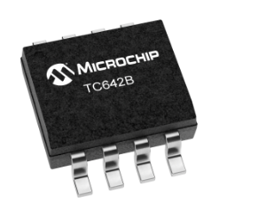

85V Half Bridge MOSFET Driver

Part <strong>No.</strong>

TC642BEOA

<strong>Price:</strong> 1.61$/each

<a href="https://www.microchipdirect.com/product/TC642BEOA?gclid=CjwKCAiAuOieBhAIEiwAgjCvcgegk6d1PwPW9TL-aTwDLVQP5Tuk5Z3oMNNYpVNv3R-ySG3dkM5-2hoCWoUQAvD_BwE"><u>Link</u></a>
</th>
<th><ul>
<li><blockquote>

Speed controller

</blockquote></li>
<li><blockquote>

Auto shut down

</blockquote></li>
<li><blockquote>

Fan sens

</blockquote></li>
</ul></th>
<th><ul>
<li><blockquote>

The most expensive option

</blockquote></li>
<li><blockquote>

No sm bus

</blockquote></li>
<li><blockquote>

Missing-pulse detector monitors

</blockquote></li>
</ul></th>
</tr>
<tr class="odd">
<th>
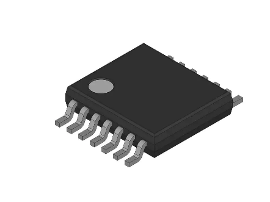

Brush DC Motor Controller

Part <strong>No.</strong>

IFX9201SGAUMA1

<strong>Price:</strong> 4.88$/each

<a href="https://www.digikey.com/en/products/detail/infineon-technologies/IFX9201SGAUMA1/5415542"><u>Link</u></a>
</th>
<th><ul>
<li><blockquote>

Lowest price

</blockquote></li>
<li><blockquote>

Previous experience with FAN8100N

</blockquote></li>
<li><blockquote>

Drive up to 3A

</blockquote></li>
</ul></th>
<th><ul>
<li><blockquote>

Power efficiency

</blockquote></li>
<li><blockquote>

Not available in peralta lab

</blockquote></li>
<li><blockquote>

Only up to 9v of supplying and loading voltage

</blockquote></li>
</ul></th>
</tr>
</thead>
<tbody>
</tbody>
</table>

<figure class="image">  

  

   

</figure>

**Choice:** 3rd Option

**Rationale:** We chose that option because we have previous experience
with that part. It is also the least expensive part and has the required
range of the power supply as it works from 1.8-9v.

-   Barrel Jack

<table>
<colgroup>
<col style="width: 33%" />
<col style="width: 33%" />
<col style="width: 33%" />
</colgroup>
<thead>
<tr class="header">
<th><strong>Solution</strong></th>
<th><strong>Pros</strong></th>
<th><strong>Cons</strong></th>
</tr>
<tr class="odd">
<th>
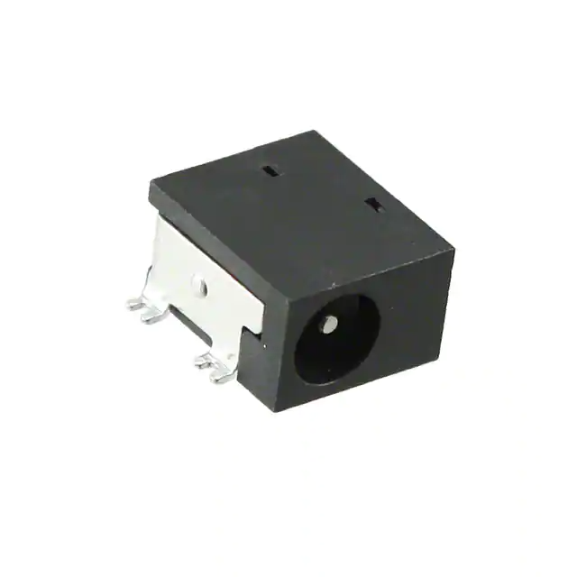

DC-Power Connectors

Part <strong>No.</strong>

PJ-014CH-SMT-TR

<strong>Price</strong>: 1.16$

<a href="https://www.mouser.com/ProductDetail/CUI-Devices/PJ-014CH-SMT-TR?qs=sGAEpiMZZMv1TUPJeFpwbqPioV%2FJqV42Z1vxV%252BE55U5kVPK3J5%2F0Kg%3D%3D"><u>Link</u></a>
</th>
<th><ul>
<li><blockquote>

Low cost

</blockquote></li>
<li><blockquote>

Rated for 24VDC

</blockquote></li>
<li><blockquote>

Rated for 3.5A

</blockquote></li>
</ul></th>
<th><ul>
<li><blockquote>

Larger footprint

</blockquote></li>
</ul></th>
</tr>
<tr class="header">
<th>
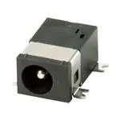

DC Power Connectors

Part <strong>No.</strong>

PJ-075DH-SMT-TR

<strong>Price</strong>: 1.15$

<a href="https://www.mouser.com/ProductDetail/CUI-Devices/PJ-075DH-SMT-TR?qs=sGAEpiMZZMv1TUPJeFpwbqPioV%2FJqV42apCsPRCy1JEgv1XhwqI1mg%3D%3D"><u>Link</u></a>
</th>
<th><ul>
<li><blockquote>

Low cost

</blockquote></li>
<li><blockquote>

Rated for 24VDC

</blockquote></li>
<li><blockquote>

Small footprint

</blockquote></li>
<li><blockquote>

Rated for 3.5A

</blockquote></li>
</ul></th>
<th><ul>
<li><blockquote>

Smaller outer contact

</blockquote></li>
</ul></th>
</tr>
<tr class="odd">
<th>
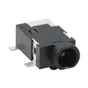

DC Power Connectors 0.65x 2.6mm

Part <strong>No.</strong> PJ-042-SMT-TR

<strong>Price</strong>: 1.30$

<a href="https://www.mouser.com/ProductDetail/CUI-Devices/PJ-042-SMT-TR?qs=sGAEpiMZZMv1TUPJeFpwbqPioV%2FJqV42QBQ%252BVrvS20amyriTrC08GQ%3D%3D"><u>Link</u></a>
</th>
<th><ul>
<li><blockquote>

Small footprint

</blockquote></li>
<li><blockquote>

Rated for 24VDC

</blockquote></li>
<li><blockquote>

Lightweight

</blockquote></li>
</ul></th>
<th><ul>
<li><blockquote>

Higher cost

</blockquote></li>
<li><blockquote>

Uncommon connector size

</blockquote></li>
<li><blockquote>

Low amperage rating

</blockquote></li>
</ul></th>
</tr>
</thead>
<tbody>
</tbody>
</table>
<figure class="image">  

  

   

</figure>

**Choice:** 2nd Option.

**Rationale:** The third option has too low of an amperage rating to be
used so the choice was between one and two mostly. Both of these are
similar and work well, but the smaller footprint for the PCB made option
two the better choice.

-   Switching Regulator

<table>
<colgroup>
<col style="width: 33%" />
<col style="width: 33%" />
<col style="width: 33%" />
</colgroup>
<thead>
<tr class="header">
<th><strong>Solution</strong></th>
<th><strong>Pros</strong></th>
<th><strong>Cons</strong></th>
</tr>
<tr class="odd">
<th>
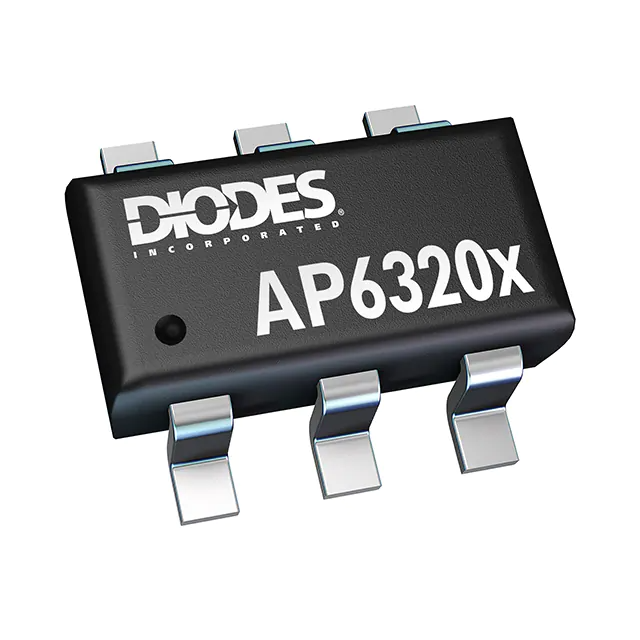

IC REG BUCK 3.3V 2A

Part <strong>No.</strong>

AP63203WU-7

<strong>Price</strong>: 0.91$

<a href="https://www.digikey.com/en/products/detail/diodes-incorporated/AP63203WU-7/9858426"><u>Link</u></a>
</th>
<th><ul>
<li><blockquote>

Cheaper cost

</blockquote></li>
<li><blockquote>

Good 2A output

</blockquote></li>
<li><blockquote>

Smaller footprint

</blockquote></li>
</ul></th>
<th><ul>
<li><blockquote>

Operating temperature range is lower

</blockquote></li>
</ul></th>
</tr>
<tr class="header">
<th>
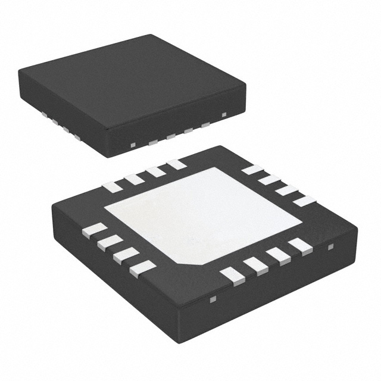

IC REG BUCK 3.3V 3A

Part <strong>No.</strong>

TS30013-M033QFNR

<strong>Price</strong>: 2.06$

<a href="https://www.digikey.com/en/products/detail/semtech-corporation/TS30013-M033QFNR/5415605"><u>Link</u></a>
</th>
<th><ul>
<li><blockquote>

Large 3A output

</blockquote></li>
<li><blockquote>

Connections add for greater use diversity

</blockquote></li>
</ul></th>
<th><ul>
<li><blockquote>

Higher cost

</blockquote></li>
<li><blockquote>

Large footprint

</blockquote></li>
</ul></th>
</tr>
<tr class="odd">
<th>
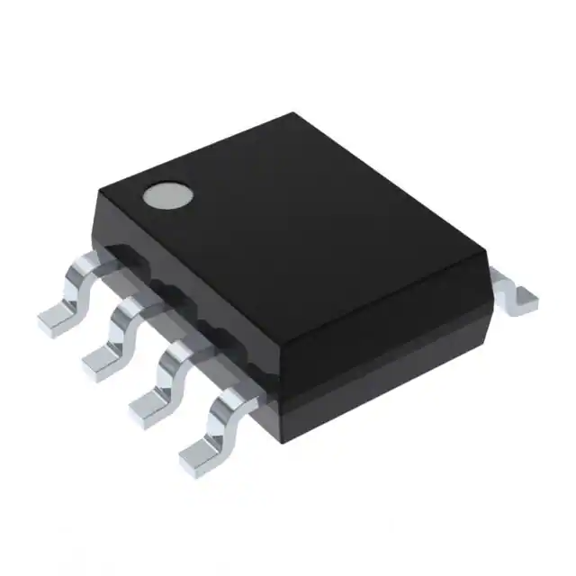

IC REG BUCK 3.3V 500MA

Part <strong>No.</strong>

MAX5033AASA+T

<strong>Price</strong>: 3.87$

<a href="https://www.digikey.com/en/products/detail/analog-devices-inc-maxim-integrated/MAX5033AASA-T/1515262"><u>Link</u></a>
</th>
<th><ul>
<li><blockquote>

Smaller size

</blockquote></li>
<li><blockquote>

Easily found PCB footprint

</blockquote></li>
</ul></th>
<th><ul>
<li><blockquote>

Very expensive

</blockquote></li>
<li><blockquote>

Lower output current

</blockquote></li>
<li><blockquote>

Voltage input minimum higher

</blockquote></li>
</ul></th>
</tr>
</thead>
<tbody>
</tbody>
</table>

<figure class="image">  

  

   

</figure>

**Choice:** 1st Option.

**Rationale:** The second option has more diverse use, but takes up more
space on a board where space is limited. The third option was actually
good, but the cost is far higher than either of the other options and
the output current may become a limiting factor. Due to this the first
option was the best choice for the purposes of our build

*\*\* We will use the 9V power supply from 304 kit “AlloverPower Part
#B08TW9L8VX 9V 3A\*\**

---
## [Power Budget Link](https://docs.google.com/spreadsheets/d/1xDC5_bySi3eCGrE1WJuqg33BrfvGr20x/edit#gid=1556561585)
---

Both major component selection and power budgeting are critical to the success of a
system. Properly selecting the components and ensuring that the power supply is 
sufficient will help to ensure that the system operates as intended and meets its performance requirements.
