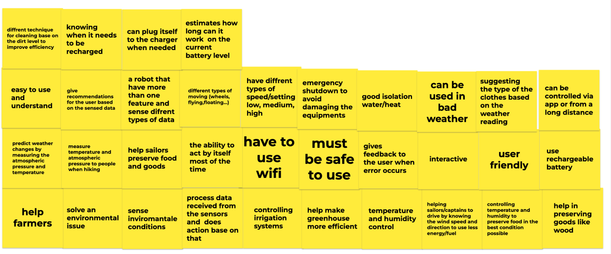
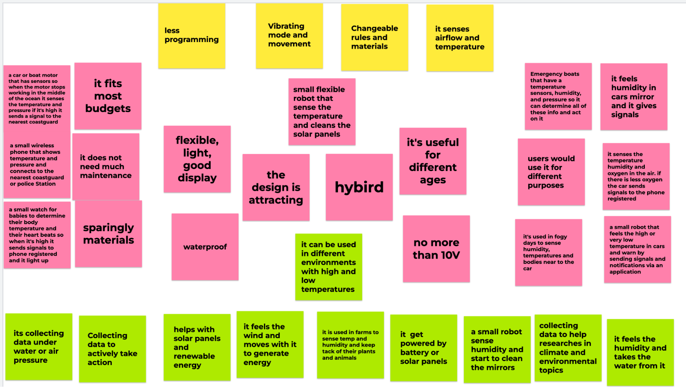
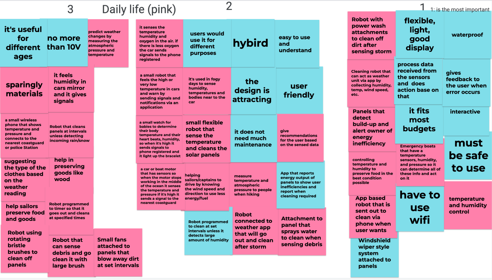
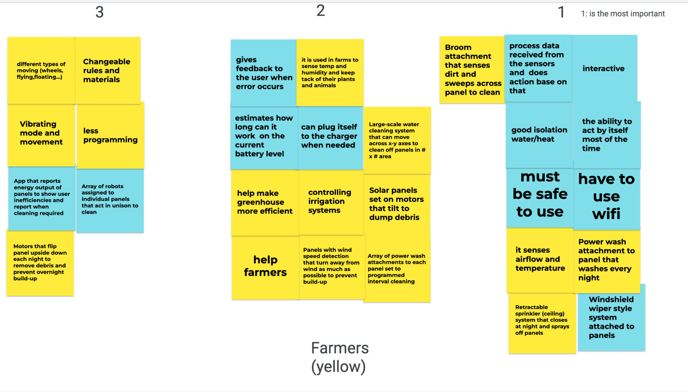
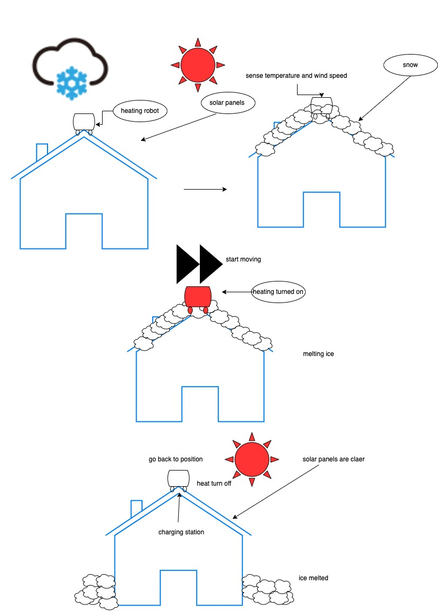
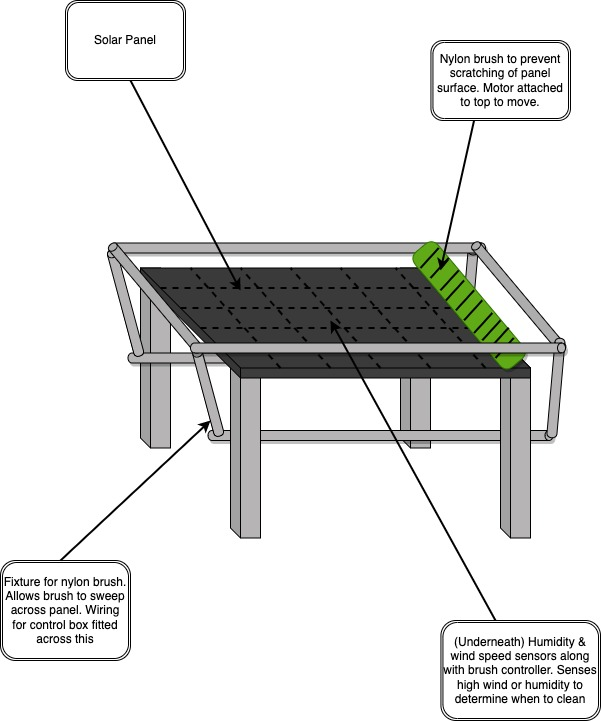

# **3.0 Design Ideation** 

## **3.1 Background and Steps** 

The purpose of these steps is to maximize the number of ideas for our
final product. Using this process we are aiming to get three main
concepts. We started by brainstorming all the ideas, features and styles
of our projects. After that, we categorized the different ideas into
four main categories which are environmental, daily life helper, farmers
and common features . Moreover, we colored every category differently in
order to make it easy to track every idea. Next we ranked all the ideas
in a scale from one to three with one being the most important and three
being the least important. Finally, we started designing our concepts
based on our top ranked ideas.

## **3.2 Brainstorming Steps and Ideas** 

We brainstormed about 100 ideas and project concepts by thinking about
the required features that we generated from the user needs list. We
started with three different empty boards and started to fill them with
the concepts/ideas sticky notes.

<figure class="image">  

  

   
   
   
  

Figure 7 - Design Ideation

</figure>

  - > **Grouping**

After brainstorming our ideas we grouped them into the following four
different colors:

**Table 11. Grouping Key**

| Pink   | Daily Life Ideas |
| ------ | ---------------- |
| Green  | Environmental    |
| Yellow | Farmers Help     |
| Blue   | Common Features  |

<figure class="image">  

  

 
   
   

Figure 8 - Grouped Ideas 

</figure>

  - > **Ranking**

Then, we moved every group of ideas to their own slide and ranked them
according to the importance level and requirements for the project with
number one being the most important.

<figure class="image">  

  

 
   
   

Figure 9 - Ranked Ideas  

</figure>

## **3.3 Product Concept Sketches** 

**Design concept \#1**

The concept behind this design is to provide the market with fully
equipped and ready to use solar panels. It has sensors to detect the
dust, temperature and humidity. When it detects a certain amount of
humidity or dust it sends signals to the washer system, and the whole
system collaborates to get rid of the extra water and dust. This design
is effective and full of different features.

<figure class="image">  

  

   

Figure 10 - First Product Concept   

</figure>

**Design Concept \#2**

The idea of this concept is a heat emitting robot that moves on the
solar panels after a snow storm to melt the snow from the roof to. When
the robot reads the temperature and wind speed that indicate the end of
the storm for it to start to warm up and melt the snow. It also has a
charging station that is powered by solar panels. 
<figure class="image">  

  

   

Figure 10 - Second Product Concept   

</figure>

**Design Concept \#3**

A nylon brush attached to a motor and fixture to sweep across a solar
panel. The controller is located underneath the panel and works in
tandem with a humidity sensor and wind speed sensor. This lets the
controller decide a good time to clean based on whether rain is likely
or high winds have blown more dust and debris onto the
panel.
<figure class="image">  

  

   

Figure 12 - Third Product Concept   

</figure>

**Design Ideation Assessment**

Overall, the team now has a clear idea of what the final project will
look and function like. The step of design ideation made all of us on
the same page while we were brainstorming and designing. Finally we are
looking for more feedback to make the final decision.

# **Selected Design**

As a team, we chose the third option for our concept designs. Mainly we
focused on building an invention that helps increase the efficiency of solar panels. Our idea
was primarily designed for the solar panel to clean itself
and produce more energy. we chose the third concept because it satisfied all of our user's needs
as it sens temperature and controls the motors based on the reading from the sensor.

<figure class="image">  

  

   

Figure 12 - Third Product Concept   

</figure>

