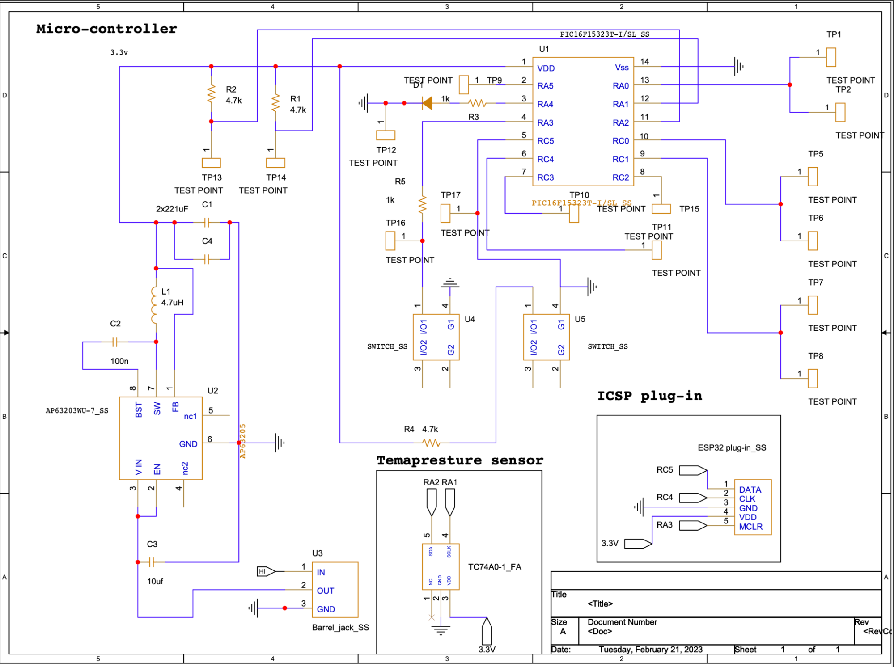

# **8.0 Hardware Implementation**

For our hardware proposal we have our microcontroller with multiple test points for programming and debugging purposes. We also have our switching regulator circuit, temperature sensor, ESP32, and ICSP plug-in for programming the microcontroller.

Our objective here is to design a PCB layout for our team system that integrates all the individual subsystems onto a single board. We have successfully constructed the PCB for our main subsystem, which is the temperature sensor.
	
During the Hardware Implementation stage of the project, we encountered a number of significant challenges. One of the primary difficulties was the fact that we were working with a microcontroller that had only 8-bit memory, which made the implementation process more complicated than we initially anticipated. Despite this challenge, our team was able to overcome the difficulty and effectively reduce the primary code, ultimately allowing us to replace the microcontroller prior to the final implementation stage. 

If we were to create a "Version 2.0" of our hardware design, we would focus on improving the integration of all individual subsystems onto a single board. While we were successful in constructing the PCB for our main subsystem, the temperature sensor, there is still room for improvement. One of the improvements we could make is to incorporate more powerful and efficient microcontrollers with greater memory and processing capabilities. This would enable us to handle more complex calculations and allow us to implement additional features that were not feasible with the current microcontroller.

Another area of improvement could be to include more comprehensive diagnostics and monitoring capabilities. For example, we could add sensors to measure various parameters such as voltage, current, and temperature throughout the system, allowing us to monitor the health and performance of the system more accurately. Additionally, we could incorporate wireless communication capabilities, enabling us to remotely monitor and control the system. We implemented using ESP 32 but it could be improved more by enabling human interaction with the application. 

In terms of the schematic above, we could improve the design by including additional components such as a lighting sensor. On the other hand,  reducing the overall size and complexity of the system, making it more user-friendly and efficient. Additionally, we could optimize the placement of components to minimize noise and improve signal integrity, which would improve the overall performance and reliability of the system. 

In summary, there are several areas in which our hardware design could be improved in "Version 2.0" of the project. These improvements would enable us to implement additional features, increase the efficiency and reliability of the system, and make it more user-friendly for our product. 
 

<figure class="image">  

  

   

Figure 15 - Hardware proposal  

</figure>

Since we are only two members in the team we only have 2 subsystems the microcontroller and the temperature sensor. The motor driver is not connected to anything because it is just for testing and adding functionality to our project. 

---
## [Bill Of Materials Link](https://docs.google.com/spreadsheets/d/1gwBahsOsEQ39IGG7Yhnm-0OQNQgcIMSc/edit#gid=243184003)
---

