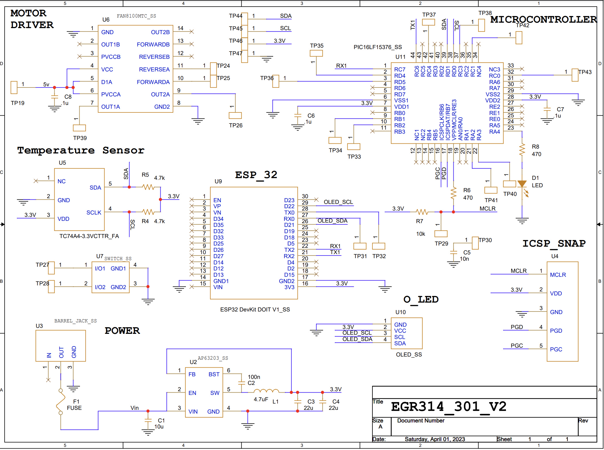

# **8.0 Hardware proposal**

For our hardware proposal we have our microcontroller with multiple test
points for programming and debugging purposes. We also have our
switching regulator circuit, temperature sensor and the ICSP plug in for
programming the microcontroller.

<figure class="image">  

  

   

Figure 15 - Hardware proposal  

</figure>

