<h1 align="center">Environmental Sensing Invention</h1> 
 
 
 
<h4 align="center"> Checkpoint 1</h4> 

<h4 align="center">Team 301</h4> 

<h4 align="center">Timothy Drafz</h4> 

<h4 align="center">Salsabil Soliman</h4>

<h4 align="center">Fatema Alshehhi</h4>

<h4 align="center">Sivanee Naghichetty</h4>

<h4 align="center">Arizona State University</h4>

<h4 align="center">EGR 314</h4>

<h4 align="center">Prof. Travis Kelley</h4>

<h4 align="center">1/20/2023</h4>
 
 

[**Presentation
Link**](https://youtu.be/ZJIEgCf_MdA)

 
 
 
 
 
 
 

**[1.0 Team Organization]**

> [1.1 Charter] 
> 
> [1.2 Product Mission Statement]

**[2.0 User Needs, Benchmarking and Requirements]**

> [2.1 Voice Of Customers]
> 
> [Jamboard Progress and Steps]
> 
> [User Needs and Benchmarking Assessment]
> 
> [2.2 Product Requirements]
> 
> [Product requirement Assessment]

**[3.0 Design Ideation]**

> [3.1 Background and Steps]
> 
> [3.2 Brainstorming Steps and Ideas]
> 
> [3.3 Product Concept Sketches]
> 
> [Design Ideation Assessment]

**[4.0 Appendix]**

> [Communication Channels]
> 
> [Communication Procedures]
> 
> [Meeting Schedule]
> 
> [Team Coordination]
> 
> [Roles and Responsibilities]
> 
> [How will you assign technical responsibilities to the team
> members?]
> 
> [User needs list]
> 
> [Our Team Milestones]

# **1.0 Team Organization** 

## **1.1 Charter**

As a team, we are planning on applying all the knowledge we gained in
electrical and mechanical skills into a new product. Our team will put
full effort into designing a new environmental sensing product that aids
users and is user friendly.

For goals our group would like to:

  - > Create a product that real world customers would consider using.

  - > Build a high value and efficient product and to be easy to
    > manufacture and access for the user.

  - > Focus on our users and make our product easy to understand and
    > use.

  - > Create a new design/idea in the environmental field that focuses
    > on solving a real challenge.

  - > Challenge ourselves to design and build something that could be
    > included on a resumé.

## **1.2 Product Mission Statement**

Our team mission statement is to improve the clean energy generation
industry, specifically solar energy, and make it more efficient so that
users are able to get the most benefit from their solar energy source.

When coming up with the charter and mission statement for our team we
discussed what we wanted our goals to be first. Once we had an idea for
some of our goals we looked at the project requirements and thought of
what we may want our mission statement and charter to be. When
discussing this we wanted to make sure we emphasized the user
friendliness aspect of a product since we felt that would be one of the
most crucial parts of any design we made. After forming the charter we
then specified our mission statement down to solar energy efficiency.
This was because we started to develop an idea of where we may want our
actual design to be, and what was actually achievable in the semester.

# **2.0 User Needs, Benchmarking and Requirements**

Starting our project by benchmarking all the liked products from the
markets that have specific features. As a team we were looking for
existing products that sense the environment and take action according
to the data gathered. Moreover, our main process to help us find these
products was benchmarking. After every team member finished their
benchmarking we started looking for the positive and negative reviews in
order to take a look at the challenges that are already in the market.
Our goal is to solve one of the issues that will help the environment
positively, not only that take data from it. Based on that we gathered
60 user needs and as a team we added 40 more in a brainstorming session.
After that, the user needs were categorized into two main groups which
are efficiency and user interactions. Next we ranked them from one to 3
which one is the most important need. Below you will go over our steps.

## 2.1 Voice Of Customers 

**Benchmarking**

**Product \#1** [Robot
Vacuum](https://www.amazon.com/Thamtu-G10-Super-Thin-Self-Charging-Medium-Pile/dp/B09BYC76PZ/ref=sr_1_1_sspa?keywords=dust%2Bdetection%2BRobotic%2BVacuums&qid=1673836422&s=vacuums&sr=1-1-spons&ufe=app_do%3Aamzn1.fos.f5122f16-c3e8-4386-bf32-63e904010ad0&spLa=ZW5jcnlwdGVkUXVhbGlmaWVyPUEyM0gyWFk0S0NKQjhWJmVuY3J5cHRlZElkPUEwODU5Mzk3MTBJUFYzSDVZQ0c2QSZlbmNyeXB0ZWRBZElkPUExMDMyNjk5MzlWN0RPUDZFR0JQVCZ3aWRnZXROYW1lPXNwX2F0ZiZhY3Rpb249Y2xpY2tSZWRpcmVjdCZkb05vdExvZ0NsaWNrPXRydWU&th=1)

**Keyword:** Cleaning Robot

**Search Result Link:**
[Link](https://www.google.com/search?q=cleaning+robot&rlz=1C5GCEM_enEG915EG915&oq=cleaning+robot&aqs=chrome.0.69i59j0i512l4j46i512j0i512l4.3283j0j7&sourceid=chrome&ie=UTF-8)

<figure class="image">  

  

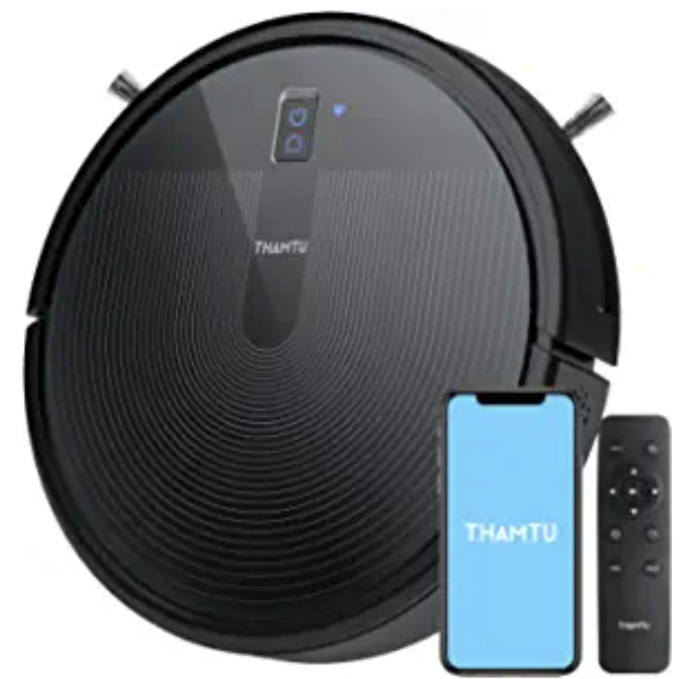   

Figure 1 - Robot Vacuum  

</figure>

  - > Price: $159.99

  - > Vendor: YunIntel on amazon

  - > Description: 2700Pa Strong Suction, Super-Thin Robotic Vacuum
    > Cleaner, Compatible with Alexa, Clean Schedule, Self-Charging,
    > Ideal for Pet Hair, Hard Floor, Medium-Pile Carpet

**Table 1. Positive Comment For Robot
Vacuum**

<table>
<thead>
<tr class="header">
<th>Voice of the customer</th>
<th>Restated customer needs</th>
</tr>
</thead>
<tbody>
<tr class="odd">
<td>This vacuum works great on thick carpet with multiple rugs. I was extremely surprised to see that it balances having solid suction power while not tearing up fringes on my multiple Moroccan rugs. On one cycle, it only gets caught maybe once and that's only if it's an unusual object in the way (like a rubber bottle). It does occasionally flip one of the corners of the rugs but far better than I thought it would do.</td>
<td><ol type="1">
<li><blockquote>

Have to work on different environment/surface (explicit)

</blockquote></li>
<li><blockquote>

Doesn't lose power quickly (explicit)

</blockquote></li>
<li><blockquote>

Does not corrupt/damage the surface (explicit)

</blockquote></li>
<li><blockquote>

Solid balance (explicit)

</blockquote></li>
<li><blockquote>

Knows how to process data and act when unusual object was on the way (latent)

</blockquote></li>
</ol></td>
</tr>
<tr class="even">
<td>I looked at others twice to three times as much and saw the reviews on this one. I kid you not when I say this vacuum saved me sanity. The programmable times and the fact that I can set barriers is a perk.</td>
<td><ol type="1">
<li><blockquote>

Good reviews/reputation (explicit)

</blockquote></li>
<li><blockquote>

Ability to control the working time (explicit)

</blockquote></li>
<li><blockquote>

Control the space in where it is working (explicit)

</blockquote></li>
</ol></td>
</tr>
<tr class="odd">
<td>I love this vacuum, especially for the price. This is my first robot vacuum so I cannot compare, but the amount of dirt it gets out of my carpet and floors is awesome. My kids even gave the vacuum a name. I use it almost everyday. It really does help when you are trying to multitask. I wish it had a longer battery, it lasts a little under an hour for my first floor because it does bump into a few things.</td>
<td><ol type="1">
<li><blockquote>

Competitive price (explicit)

</blockquote></li>
<li><blockquote>

Efficient work (latent)

</blockquote></li>
<li><blockquote>

The ability to do daily work (latent)

</blockquote></li>
<li><blockquote>

Need longer battery life (explicit)

</blockquote></li>
<li><blockquote>

Efficient battery use (latent)

</blockquote></li>
</ol></td>
</tr>
</tbody>
</table>

**Table 2. Negative Comment For Robot
Vacuum**

<table>
<thead>
<tr class="header">
<th>Voice of the customer</th>
<th>Restated customer needs</th>
</tr>
</thead>
<tbody>
<tr class="odd">
<td>This was difficult to set up on internet. We had to literally be right next to the router. The unit gets stuck under furniture or hung up on the tiniest things often. The time I spend rescuing it, defeats the purpose of having</td>
<td><ol type="1">
<li><blockquote>

Need to be easy to set up (explicit)

</blockquote></li>
<li><blockquote>

Should be able to process data correctly as it should (latent)

</blockquote></li>
<li><blockquote>

Should have less programming errors (latent)

</blockquote></li>
<li><blockquote>

Should not waste users time and should meet the purpose that it was made for (explicit)

</blockquote></li>
</ol></td>
</tr>
<tr class="even">
<td>
I was fairly pleased with this vacuum when I first received it; however the suction stopped working after 6 weeks of use. I contacted support who stated I would receive a replacement within 2-3 days, but it's been over a week and I haven't received either the replacement or a refund. Contacted support again. Replacement they promised was never sent so I requested a refund which was processed within a few hours.

Update: support contacted me the day after. They also sent a new vacuum even though I had received refund. New vacuum received in 2 days.

Update: replacement vacuum has stopped working.

ALSO, company told me they would give me a $25 gift card if I changed my review to 5 stars which I declined
</td>
<td><ol type="1">
<li><blockquote>

Should last as long as it should, it worked for only 6 months (explicit)

</blockquote></li>
<li><blockquote>

The replacement should be tested/inspected before giving it to the user (explicit)

</blockquote></li>
<li><blockquote>

Should not have failure parts in more than one product/ all of the product line (latent)

</blockquote></li>
</ol></td>
</tr>
<tr class="odd">
<td>I've had this for a few months now and it was perfect. Up until it started just dying on its own in the middle of the floor and not turning on at all. Previously it would say when the battery is low and then go put itself on the charger. Now it just dies wherever it wants to and I find it later. It's only been a few months, this thing is going in the garbage.</td>
<td><ol type="1">
<li><blockquote>

Should have better feedback like showing battery remaining (explicit)

</blockquote></li>
<li><blockquote>

The product should not fail and turn on or show what type of error occurs as a feedback (explicit)

</blockquote></li>
<li><blockquote>

The battery life should not be getting shorter (latent)

</blockquote></li>
<li><blockquote>

Fixing programming issues (latent)

</blockquote></li>
</ol></td>
</tr>
</tbody>
</table>

  - > Summary: We chose this product because we were thinking of a
    > product that can sense the wind speed and temperature to calculate
    > when and where to clean the solar panels. This is a cleaning robot
    > which has a similar concept as our idea.

**Product \#2** [Cleaning
Robot](https://www.amazon.com/HOBOT-2S-Cleaning-Automatic-Ultrasonic-Smartphone/dp/B097CM7P9L/ref=sr_1_9?gclid=Cj0KCQiAq5meBhCyARIsAJrtdr6MWPdjZYq8SQij6nqTB-pZ_JepKDTQodwuGpDz509W5dvOHRvN-BQaAtRHEALw_wcB&hvadid=557499389495&hvdev=c&hvlocphy=9030087&hvnetw=g&hvqmt=e&hvrand=12761662262154527549&hvtargid=kwd-301823196623&hydadcr=21298_13296724&keywords=solar+panel+cleaning+robot&qid=1674017362&sr=8-9&ufe=app_do%3Aamzn1.fos.c3015c4a-46bb-44b9-81a4-dc28e6d374b3)

**Keywords:** Cleaning Robot Solar

**Search Results Link:**
[Link](https://www.google.com/search?q=Cleaning+Robot+Solar&rlz=1C5GCEM_enEG915EG915&oq=Cleaning+Robot+Solar&aqs=chrome..69i57j0i512j0i22i30j0i15i22i30j0i22i30j69i61l2j69i60.427j0j7&sourceid=chrome&ie=UTF-8#ip=1)

<figure class="image">  

  

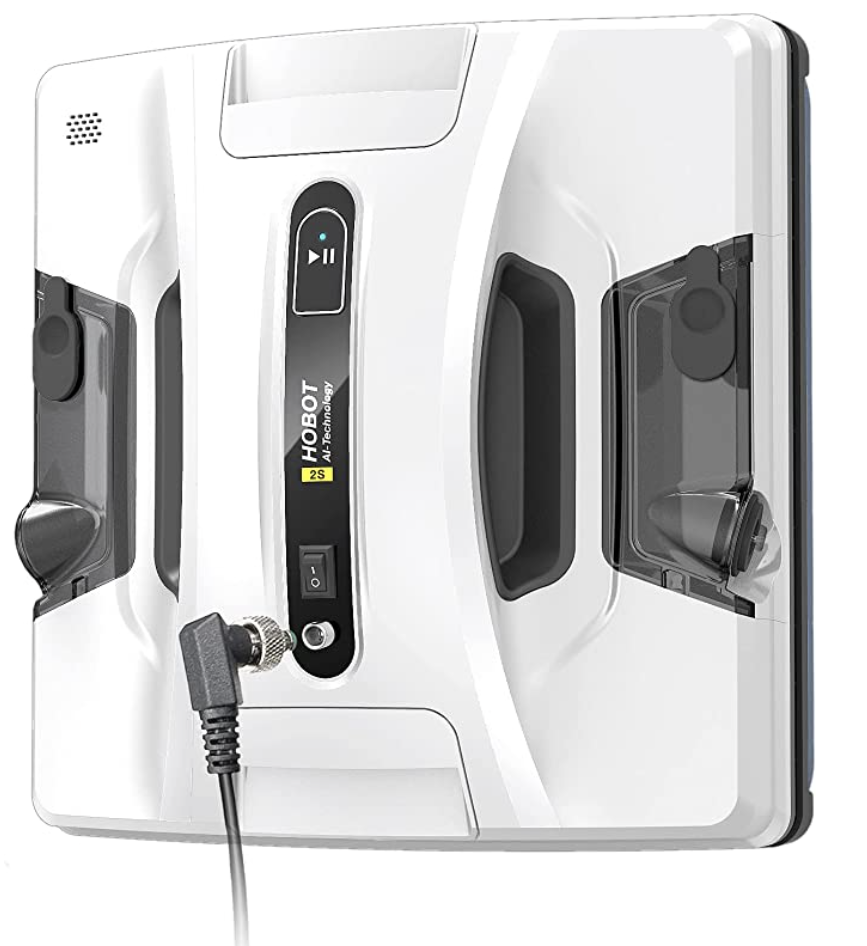   

Figure 2 - Cleaning Robot  

</figure>

  - > Price: $ 499

  - > Vendor: Home Robot LLC on Amazon

  - > Description: HOBOT-2S Window Cleaning Automatic Smart Robot with
    > Dual Ultrasonic Water Spray and Control via Smartphone or Remote

**Table 3. Positive Comment For Cleaning
Robot**

<table>
<thead>
<tr class="header">
<th>Voice of the customer</th>
<th>Restated customer needs</th>
</tr>
</thead>
<tbody>
<tr class="odd">
<td>I found that the Hobot 2S was very easy to use. It works best on a window that is not filthy. The cleaning cloth only cleans a small amount of dirt before you need a clean one to replace it. I ordered 3 more cleaning pads and may end up ordering more. Once the dirty to clean ratio of the cleaning cloth is to the clean side, it does a great job and doesn't leave streaks on the window. I think it will be my window bot friend for a long time. I am quite happy with the job that it does.</td>
<td><ol type="1">
<li><blockquote>

The product should be easy to use/ user friendly (latent)

</blockquote></li>
<li><blockquote>

The product should work on multi dirt levels areas not just light (latent)

</blockquote></li>
<li><blockquote>

The cleaning area should be bigger/wider (explicit)

</blockquote></li>
<li><blockquote>

Would be better if it need replacement after working for a longer time (latent)

</blockquote></li>
</ol></td>
</tr>
<tr class="even">
<td>
Amazing technology in a brilliant device!

I live near a new construction project which spreads filth everywhere. On top of that, My windows haven’t been cleaned for 2 years due to the pandemic.

I was not expecting too much given the amount of dust and dirt on my windows but it worked like a charm!

A few considerations:

1. Make sure you mange your expectations by understanding what you need to do to make your robot successful. This robot needs more user interaction than a vacuum cleaning robot.
</td>
<td><ol type="1">
<li><blockquote>

Smart technology/algorithm for user need and interaction (explicit)

</blockquote></li>
<li><blockquote>

The product worked on a high dirt level surface (explicit)

</blockquote></li>
<li><blockquote>

Improving user-robot interaction experience (latent)

</blockquote></li>
<li><blockquote>

The robot need to be able to act by itself (latent)

</blockquote></li>
</ol></td>
</tr>
<tr class="odd">
<td>I really like the new robot. The detergent itself is sprayed over the window, there is no need to wet the napkins. I clean windows every six months, now I can do it often. No stains! I like it!!</td>
<td><ol type="1">
<li><blockquote>

Cleaning product/water spray (explicit)

</blockquote></li>
<li><blockquote>

The robot left no stains after cleaning (explicit)

</blockquote></li>
<li><blockquote>

Can be used frequently (explicit)

</blockquote></li>
</ol></td>
</tr>
</tbody>
</table>

**Table 4. Negative Comment For Cleaning
Robot**

<table>
<thead>
<tr class="header">
<th>Voice of the customer</th>
<th>Restated customer needs</th>
</tr>
</thead>
<tbody>
<tr class="odd">
<td>The device is insufficiency designed. Can't map out a window and therefore creates inconsistent pathways and incomplete cleaning. Gets stuck/confused against simple linear surfaces.</td>
<td><ol type="1">
<li><blockquote>

Design improvement is needed (explicit)

</blockquote></li>
<li><blockquote>

Should be able to map out the area and create consistent pathways (explicit)

</blockquote></li>
<li><blockquote>

The algorithm/coding need to be fixed as it gets stuck/confused against simple linear surfaces (explicit)

</blockquote></li>
</ol></td>
</tr>
<tr class="even">
<td>
Does not clean 100% on all windows. The outside of my windows have a bezeled edge and it has trouble knowing where the edge of the window is which causes it to miss cleaning about 5% of the window. The inside of my windows are better but it can still miss corners and the very top and bottom.

I feel like the cleaning patterns could be a little smarter around edges and corners of windows. Hopefully that improves with software updates.

It's a bit pricey for not reliably cleaning 100% of the window.
</td>
<td><ol type="1">
<li><blockquote>

Should be able to identify and mark the edges of the area (explicit)

</blockquote></li>
<li><blockquote>

Should not miss areas and be able to clean the entire surface (explicit)

</blockquote></li>
<li><blockquote>

The cleaning patterns should be improved/smarter (explicit)

</blockquote></li>
<li><blockquote>

The prices should be reasonable for the technology and services it provides (latent)

</blockquote></li>
</ol></td>
</tr>
<tr class="odd">
<td>It starts cleaning but never goes up. just goes down. the previous version was much better. it worked and cleaned glasses and windows. unfortunately this version seems to have an issue with the rotor band.</td>
<td><ol type="1">
<li><blockquote>

Should be able to move in any direction needed (explicit)

</blockquote></li>
<li><blockquote>

Should use a reliable materials (latent)

</blockquote></li>
<li><blockquote>

Should be able to operate efficiently in various conditions (latent)

</blockquote></li>
</ol></td>
</tr>
</tbody>
</table>

  - > Summary: For this second product search we found that window
    > cleaning is similar to the solar panels. As it is in a vertical
    > position therefore it shows how the robot should be able to
    > efficiently move and operate in various directions against
    > gravity.

**Product \#3** [Sophinique
Robot](https://www.amazon.com/Cleaner-Sophinique-Cleaning-Intelligent-Automatic/dp/B082PRY2DW?th=1)

**Keywords:** Window Cleaning Robot

**Search Results Link:**
[Link](https://www.google.com/search?q=window+cleaning+robot&sxsrf=AJOqlzXCM8vtC3rUD0icvI2HE75N2jb4ng%3A1674015488091&ei=AHPHY9KjBfyIkPIP27Cj6AY&ved=0ahUKEwjSo5DUodD8AhV8BEQIHVvYCG0Q4dUDCBA&uact=5&oq=window+cleaning+robot&gs_lcp=Cgxnd3Mtd2l6LXNlcnAQAzIHCAAQsQMQQzIFCAAQgAQyBQgAEIAEMgUIABCABDIFCAAQgAQyBQgAEIAEMgUIABCABDIFCAAQgAQyCggAEIAEEIcCEBQyBQgAEIAEOgQIIxAnOgUIABCRAjoLCAAQgAQQsQMQgwE6DgguEIAEELEDEMcBENEDOhEILhCABBCxAxCDARDHARDRAzoLCC4QgAQQsQMQgwE6BAgAEEM6BwgAEMkDEEM6CggAELEDEIMBEEM6CggAELEDEMkDEEM6CwguEIAEEMcBEK8BOgsIABCABBCxAxDJAzoICAAQgAQQsQNKBAhBGABKBAhGGABQAFj9I2D-JWgAcAF4AIABdIgB1AuSAQQxOS4ymAEAoAEBwAEB&sclient=gws-wiz-serp)

<figure class="image">  

  

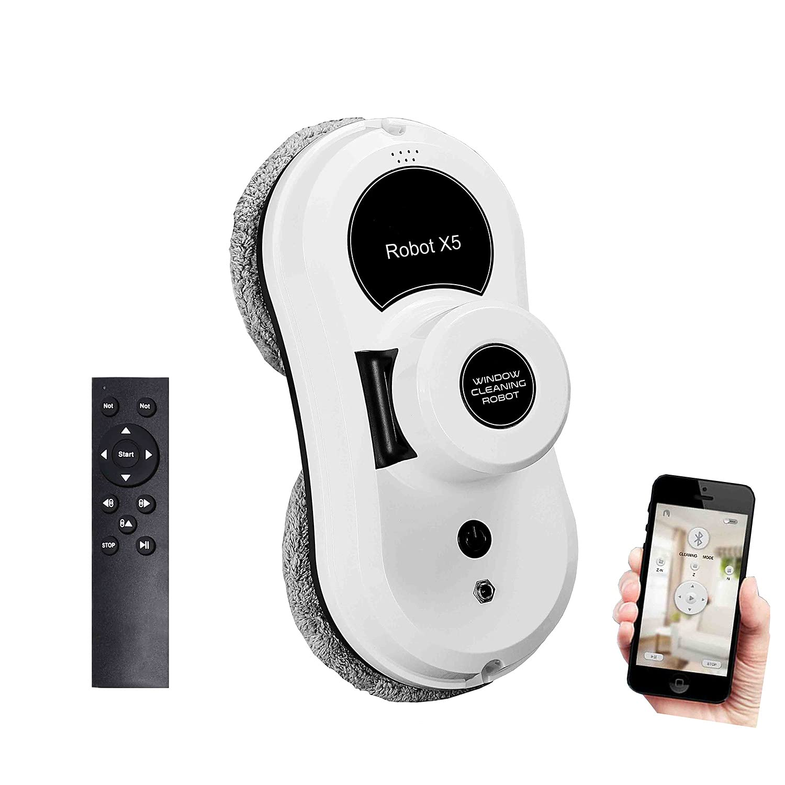   

Figure 3 - Sophinique Robot   

</figure>

  - > Price: $199.99

  - > Vendor: Sophinique on Amazon

  - > Description: X5 Window Vacuum Cleaner Smart Glass Cleaning Robotic
    > with APP & Remote, Intelligent Automatic Cleaner Robot for
    > Outdoor/Indoor Windows Table Tile Ceiling

**Table 5. Positive Comment For Sophinique
Robot**

<table>
<thead>
<tr class="header">
<th>Voice of the customer</th>
<th>Restated customer needs</th>
</tr>
</thead>
<tbody>
<tr class="odd">
<td>have many windows and teenagers…the robot is a little noisy but I just leave the room while it works and it beeps when it is done in an area. I have only used it inside, have not really used the spray feature and keep it plugged in. Cleans great with 0% elbow grease. Comes with extra microfiber socks so the robot can keep working. Needs some supervision, and a little windex on all the hand and paw prints, but overall very pleased with my window cleaner robot.</td>
<td><ol type="1">
<li><blockquote>

The product is loud (explicit)

</blockquote></li>
<li><blockquote>

The product needs to be watched (latent)

</blockquote></li>
<li><blockquote>

The product can work for long periods of time (explicit)

</blockquote></li>
</ol></td>
</tr>
<tr class="even">
<td>Wonderful product! Works well! We have crazy high windows and this removes the haze and grime that accumulates. Are they perfect? No. Is it wayyyyyyy better than never cleaning the 2nd floor windows in my house? Absolutely! Crisp and clear so I can enjoy the beautiful view!</td>
<td><ol type="1">
<li><blockquote>

Can reach high places safely (explicit)

</blockquote></li>
<li><blockquote>

The product cleans heavy build-up (explicit)

</blockquote></li>
</ol></td>
</tr>
<tr class="odd">
<td>My brother lives in an apartment building but for some reason, his windows will get dusty quite easily and he has totally given up cleaning because it was hard and no safe. I brought this X5 window cleaning for him and this really saved his day. There nothing needed other than putting the robot on the window and press the power button/or the remote. The robot will take care of the rest. Just to make sure to secure the robot just in case it falls. My brother has been using it for months and so far I have got no complaint from him. Pricy gift though</td>
<td><ol type="1">
<li><blockquote>

Can be used in smaller areas (explicit)

</blockquote></li>
<li><blockquote>

The product may fall (latent)

</blockquote></li>
<li><blockquote>

Long-lasting product (explicit)

</blockquote></li>
</ol></td>
</tr>
</tbody>
</table>

**Table 6. Negative Comment For Sophinique
Robot**

<table>
<thead>
<tr class="header">
<th>Voice of the customer</th>
<th>Restated customer needs</th>
</tr>
</thead>
<tbody>
<tr class="odd">
<td>For starters, I thought this was cordless and it’s not. It’s loud. It cleans, but basically just knocks top layer off. My windows were fairly clean to being with and they did look better than to begin with, but not a great job and not to my standards. I do not recommend at all and waited too long to try to return. What a waste of money.</td>
<td><ol type="1">
<li><blockquote>

The product should be wireless (explicit)

</blockquote></li>
<li><blockquote>

The product needs to clean multiple layers (latent)

</blockquote></li>
</ol></td>
</tr>
<tr class="even">
<td>Many of the instructions were unclear and even with contacting the manufacturer, some things still weren't clear (examples: the rope to keep the unit from falling if it lost power-where to put it, did there need to be a separate hook for each window?; what cleaning fluid to use and how much-using what the manufacturer recommending was not cleaning the window, I doubled it and it worked better). It took the robot 20 minutes to clean a relatively clean sliding glass door, when I could have cleaned it less than 5 minutes. Etc.</td>
<td><ol type="1">
<li><blockquote>

The product needs to be easy to use (explicit)

</blockquote></li>
<li><blockquote>

The product should work faster (explicit)

</blockquote></li>
</ol></td>
</tr>
<tr class="odd">
<td>Moves around randomly, does not follow the automatic cleaning patterns. No matter which pattern I chose, it made no difference. Kept cleaning the same spot, making a couple moves left a couple right. I could not navigate it manually either with the remote, as after each click it makes one move, so you have to stand there and keep clicking through every single step. I spent several hours trying to make it work, but no such luck. So, I gave up and cleaned my windows the traditional way. In addition the cleaning solution container is leaking.</td>
<td><ol type="1">
<li><blockquote>

The product follows set patterns (explicit)

</blockquote></li>
<li><blockquote>

The product can be used manually (latent)

</blockquote></li>
<li><blockquote>

Unable to restart automated sequence once broken (latent)

</blockquote></li>
</ol></td>
</tr>
</tbody>
</table>

  - > Summary: Our third product is the window cleaner robot. We chose
    > this product because it is both innovative and easy to access, and
    > also helps in cleaning by absorbing the dirt and small particles
    > using wind energy pressure.

**Product \#4** [Weather
Station](https://www.amazon.com/dp/B09N9HBPW6/ref=sspa_dk_detail_2?psc=1&pd_rd_i=B09N9HBPW6&pd_rd_w=M3yTg&content-id=amzn1.sym.dd2c6db7-6626-466d-bf04-9570e69a7df0&pf_rd_p=dd2c6db7-6626-466d-bf04-9570e69a7df0&pf_rd_r=WGYG7588J7ZZMMJK3XBC&pd_rd_wg=zkHKd&pd_rd_r=9086df82-2872-4a4d-a049-24f96e76a9e2&s=home-garden&sp_csd=d2lkZ2V0TmFtZT1zcF9kZXRhaWxfdGhlbWF0aWM&spLa=ZW5jcnlwdGVkUXVhbGlmaWVyPUFVWE9aVkpGQkMwTVcmZW5jcnlwdGVkSWQ9QTA4NjY3MTRETTUwMDlLUzM3NEQmZW5jcnlwdGVkQWRJZD1BMDUwNTM0NzJDMlRDOURMM0JMVEomd2lkZ2V0TmFtZT1zcF9kZXRhaWxfdGhlbWF0aWMmYWN0aW9uPWNsaWNrUmVkaXJlY3QmZG9Ob3RMb2dDbGljaz10cnVl)

**Keywords:** Weather Station Indoor Outdoor

**Search Results Link:**
[Link](https://www.google.com/search?q=Weather+Station+Indoor+Outdoor&sxsrf=AJOqlzVU021kAruAcsSpngwYfEy_mi9K5A%3A1674028547341&ei=A6bHY5vIFM-fkPIPwMaR2Ag&ved=0ahUKEwjb1aGn0tD8AhXPD0QIHUBjBIsQ4dUDCBA&uact=5&oq=Weather+Station+Indoor+Outdoor&gs_lcp=Cgxnd3Mtd2l6LXNlcnAQAzIFCAAQgAQyBQgAEIAEMgUIABCABDIGCAAQFhAeMgkIABAWEB4Q8QQyBggAEBYQHjIGCAAQFhAeMgYIABAWEB4yBggAEBYQHjIGCAAQFhAeOgcIIxDqAhAnOg0IABCPARDqAhC0AhgBSgQIQRgASgQIRhgBUABYpgVg_wloAXABeACAAU-IAU-SAQExmAEAoAEBoAECsAEUwAEB2gEGCAEQARgK&sclient=gws-wiz-serp)

<figure class="image">  

  

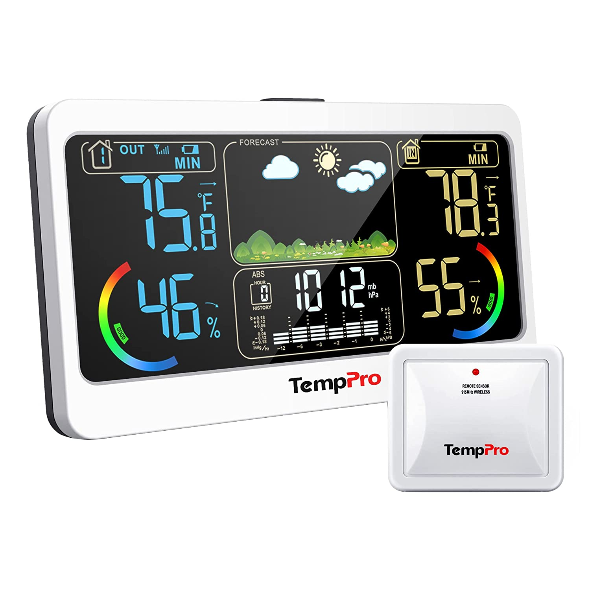   

Figure 4 - Weather Station   

</figure>

  - > Price: 42.12$

  - > Vendor: Amazon

  - > Description: Wireless Home Weather Station with Digital
    > Temperature Humidity Meter for Weather Forecast

**Table 7. Positive comment for weather
station**

<table>
<thead>
<tr class="header">
<th>Voice of the customer</th>
<th>Restated customer needs</th>
</tr>
</thead>
<tbody>
<tr class="odd">
<td>Very nice display and very easy to read from across the room.</td>
<td><ol type="1">
<li><blockquote>

Nice Display and design (explicit)

</blockquote></li>
<li><blockquote>

Good labeling and practical while using (explicit)

</blockquote></li>
</ol></td>
</tr>
<tr class="even">
<td>Has been working flawlessly since purchaced. Easy set up. We line in Minnesota, and have wild temperature swings, and it has be true from 99F to 12F so far.</td>
<td><ol type="1">
<li><blockquote>

Easy to set up and use (explicit)

</blockquote></li>
<li><blockquote>

Works with huge range of temperature (latent)

</blockquote></li>
</ol></td>
</tr>
<tr class="odd">
<td>I got this for all indoor use and it worked great. I have a poorly insulated cape cod home, so the master is upstairs and changes temp fast depending on the outside weather. I put the 2nd thermometer upstairs and could track how much I needed to pump AC/heat and if it needed vapor or dehumidifying. Then I moved it outside for the fall season so I knew how to dress when taking my dogs outside. Everything seems to work well, the humidity feels like it is accurate, and the temperature feels like its accurate. The interface is nice and hasn't stopped working for 6 months.</td>
<td><ol type="1">
<li><blockquote>

Good quality and work accurately anywhere under different conditions (explicit)

</blockquote></li>
<li><blockquote>

Efficient and long lasting product (explicit)

</blockquote></li>
</ol></td>
</tr>
</tbody>
</table>

**Table 8. Negative comment for weather
station**

<table>
<thead>
<tr class="header">
<th>Voice of the customer</th>
<th>Restated customer needs</th>
</tr>
</thead>
<tbody>
<tr class="odd">
<td>It didn’t work correctly out of the box neither did the second one or the third.</td>
<td><ol type="1">
<li><blockquote>

The product should work probably in different conditions (latent)

</blockquote></li>
<li><blockquote>

Features should be mentioned and readable for customers (explicit)

</blockquote></li>
</ol></td>
</tr>
<tr class="even">
<td>Outside would not work</td>
<td><ol type="1">
<li><blockquote>

Sensing product work inside and outside under different conditions (latent)

</blockquote></li>
<li><blockquote>

Good Materials to use outside (explicit)

</blockquote></li>
</ol></td>
</tr>
<tr class="odd">
<td>
I already have a similar "Weather Station" and I have to say this one made me appreciate how good my original is.

First off, the outdoor temperature sensor only updates to the main station ***once an hour***. I tested it both with temperature AND with turning the unit off and it took over an hour for the main station to "lose contact" and zero out on the outdoor temperature. That's just plain not good enough when you are having rapid temperature fluctuations. 15min should be the absolute maximum between updates.

Second, the electric wire for the main unit is maybe 4ft long. Not long enough to reach my outlet (My original unit has a 6ft wire which is more useful). There's a second, shorter wire to charge the outdoor sensor ... both use the round DC-type plug which I hate.

Finally, I really like having a clock on the unit, which I have on my original.

All in all, there are far better options out there. Wouldn't purchase this one again
</td>
<td><ol type="1">
<li><blockquote>

Good electrical and mechanical build (explicit)

</blockquote></li>
<li><blockquote>

Comfortable for users when it comes to external features (explicit)

</blockquote></li>
</ol></td>
</tr>
</tbody>
</table>

  - > Summary: We chose this product because it calculates the pressure
    > outside and gives us an accurate weather report.

**Product \#5** [Humidity Sensor
Switch](https://www.amazon.com/Generation-Humidity-Ortis-Automated-Detection/dp/B08XBRNPDF/ref=sr_1_1_sspa?crid=DPAPDHKO1YPV&keywords=humidity+sensing+switch&qid=1674016757&sprefix=sensing+hu%2Caps%2C140&sr=8-1-spons&psc=1&smid=A2QSX2ZEYU83MS&spLa=ZW5jcnlwdGVkUXVhbGlmaWVyPUFJNTdCQTlYN0hQWEUmZW5jcnlwdGVkSWQ9QTA1MzMwMjIzUDNXVkMzVDlYSE0wJmVuY3J5cHRlZEFkSWQ9QTAxMjU0MDFQNkQ4STRYSjhXOFAmd2lkZ2V0TmFtZT1zcF9hdGYmYWN0aW9uPWNsaWNrUmVkaXJlY3QmZG9Ob3RMb2dDbGljaz10cnVl)

**Keywords:** Humidity Sensor Switch

**Search Results Link:**
[Link](https://www.google.com/search?q=humidity+and+temperature+sensor&sxsrf=AJOqlzVxMTuhstgleKTEE2QJn1XfMm0M4g%3A1674028557466&ei=DabHY_2SHMDpkPIPwoqyiA4&oq=humi&gs_lcp=Cgxnd3Mtd2l6LXNlcnAQARgAMgUIABCRAjIFCAAQkQIyBAgAEEMyBAgAEEMyBAgAEEMyBwgAELEDEEMyBwgAELEDEEMyBQgAEIAEMgQIABBDMgoIABCABBCHAhAUOgcIIxDqAhAnOg0IABCPARDqAhC0AhgBOg0ILhCPARDqAhC0AhgBOgQIIxAnOhEILhCABBCxAxCDARDHARDRAzoLCAAQgAQQsQMQgwE6CwguEIAEEMcBENEDSgQIQRgASgQIRhgBUL8DWM8RYLkjaAFwAXgAgAGFAYgBkgOSAQMyLjKYAQCgAQGwARTAAQHaAQYIARABGAo&sclient=gws-wiz-serp)

<figure class="image">  

  

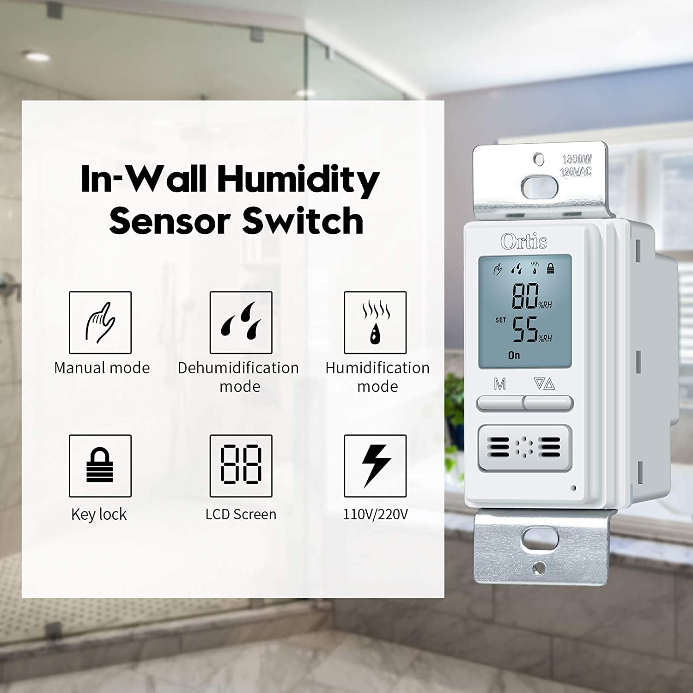   

Figure 5 - Humidity Sensor Switch  

</figure>

  - > Price: 26$

  - > Vendor: Amazon

  - > Description: humidity sensor fan switch uses a microprocessor
    > combined with the advanced digital sensing technology. To detect
    > the humidity level in the bathroom and automatically turn on the
    > exhaust fan for ventilation, keep your bathroom dry and clean,
    > creating a healthy environment for you and your family.

**Table 9. Positive Comment For Humidity Sensor
Switch**

<table>
<thead>
<tr class="header">
<th>Voice of the customer</th>
<th>Restated customer needs</th>
</tr>
</thead>
<tbody>
<tr class="odd">
<td>This product works great, and costs way less than the box stores</td>
<td><ol type="1">
<li><blockquote>

Good price with good quality (explicit)

</blockquote></li>
<li><blockquote>

Long lasting Materials (explicit)

</blockquote></li>
</ol></td>
</tr>
<tr class="even">
<td>The humidity switch works very nicely with our new high-volume bathroom exhaust fan. It was easy to install and set up. It allows you to calibrate the humidistat against other known humidity-reading devices for better accuracy. We look forward to the fan automatically starting and shutting off as humidity warrants and not worrying about leaving the fan on when we are away. Compared to alternatives at the big box stores, this product provides a good product at a fair price. So far, I recommend it</td>
<td><ol type="1">
<li><blockquote>

Works under worst circumstance and has good features (latent)

</blockquote></li>
<li><blockquote>

It does the job accurately and takes actions fast (latent)

</blockquote></li>
</ol></td>
</tr>
<tr class="odd">
<td>Installation was fairly easy. I don't understand why a ground wire wasn't needed. Either the instructions weren't included or were lost but I was able to print them off the internet. You, at least I did, need to read the programming instruction several time to understand what you need to do. After the 2nd programming, I think that I've gotten the switch working like I need. It turns out that my laundry room wasn't as humid as I suspected. The auto on had yet to happen. But I like the timer on manual.</td>
<td><ol type="1">
<li><blockquote>

Good set up process and easy (explicit)

</blockquote></li>
<li><blockquote>

Good instructions and make it as simple as possible (explicit)

</blockquote></li>
</ol></td>
</tr>
</tbody>
</table>

**Table 10. Negative Comment For Humidity Sensor
Switch**

<table>
<thead>
<tr class="header">
<th>Voice of the customer</th>
<th>Restated customer needs</th>
</tr>
</thead>
<tbody>
<tr class="odd">
<td>
My criticisms will be somewhat technical. But if you want the TL;DR this product just SUCKS. Here's why.

- Turning on the fan is a confusing double press of the "M" key. 1st press turns on the light, 2nd press turns on the fan. Super confusing for guests.

- Menus are labeled by numbers, which you have to cross-reference with the manual to understand what they control. Otherwise, they just look like a bunch of random numbers. No text.

- Humidity sensor requires calibration, otherwise, switch will turn on at the wrong times.

- Switch often does not turn on when the mirror is obviously foggy

----- Technical Feedback -----

This product has a flawed approach to sensing humidity. Humidity is something that fluctuates as part of the weather. A rainy day will trend your indoor humidity higher than a sunny day. The Ortis switch doesn't monitor the room's humidity for these changes. Instead, it keeps it at a setpoint RH%. This means that it's possible for your bathroom fan to run nonstop on a rainy day just because the RH% is higher than your setpoint.

A better approach to this rather than acting like a thermostat is to monitor the room's RH% over a long period of time and look for rapid spikes in humidity, like when you're taking a shower. There are switches the likes of Leviton that do this for you without you having to think about it. It's my belief that a smart switch should make your lifestyle easier, not harder.

Note on usability:

The interface is poorly programmed with menus being represented by numbers and confusing instructions even when you read them word-by-word. If I have to pull out the instructions every time I use it, I can imagine that guests would be intimidated by a switch like this and just never turn on the bathroom fan
</td>
<td><ol type="1">
<li><blockquote>

Easy to use and understand how it works (explicit)

</blockquote></li>
<li><blockquote>

It should have high sensing and accurately does it job (latent)

</blockquote></li>
</ol></td>
</tr>
<tr class="even">
<td>Yes this was easy to install but there is _NO_ ground connection point for a device ment to operate in a wet/damp environment. Thus I have to give this device a failing grade. I ended up attaching a ground connection to the metal faceplate where it attaches to the wallbox but still this is very suboptimal for the use this is intended for.</td>
<td><ol type="1">
<li><blockquote>

It should states how to be used in different environment with good instructions (explicit)

</blockquote></li>
<li><blockquote>

Customer services that is aware of common issues between users to answer questions or common questions answered on the instruction paper (explicit)

</blockquote></li>
</ol></td>
</tr>
<tr class="odd">
<td>
Update March 20,2022. Switch doesnt work now. Reads 98% humidity all the time. Will need to replace already and only had three months.

I've got it installed but can't say I'm thrilled with it. Has a crappy interface that requires you to know what mode 01 or 05 or 07 is to understand how to get it to work. Not sure what is wrong with an icon or english or something. If you lose the directions you'll not have a clue how to set this thing.

I've seen the humidity higher than I'd like given where I set the thing at and I'm partially judging this based on the control I had previously which came on when expected w/o fail. It didn't have the fancy readout but it just worked.
</td>
<td><ol type="1">
<li><blockquote>

Easy to fix any issue (explicit)

</blockquote></li>
<li><blockquote>

It does not need regular maintenance (explicit)

</blockquote></li>
</ol></td>
</tr>
</tbody>
</table>

  - > Summary: The product is affordable but from the customer feedback,
    > we understand that the product needs lots of additional features
    > so it is easy for the user to use it. The product comparatively
    > has a good lifetime and has good spare parts and also has an easy
    > set up process.

## 

## 

## **Jamboard Progress and Steps**

Here you can see the 100 ideas gathered.
<figure class="image">  

  

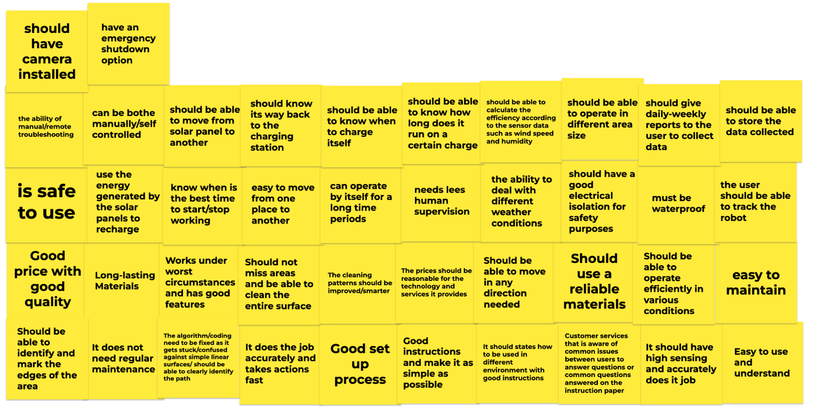 
  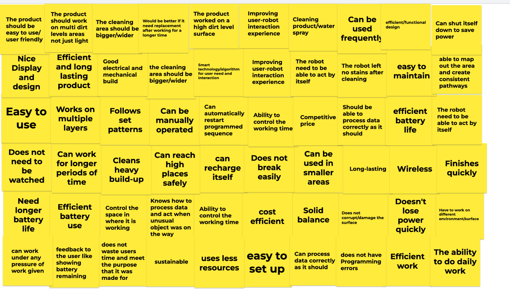  

Figure 6 - User Needs
 

</figure>

  - > **Grouping and Ranking**

> It was categorized into two groups and ranked based on color and
> number.

<figure class="image">  

  

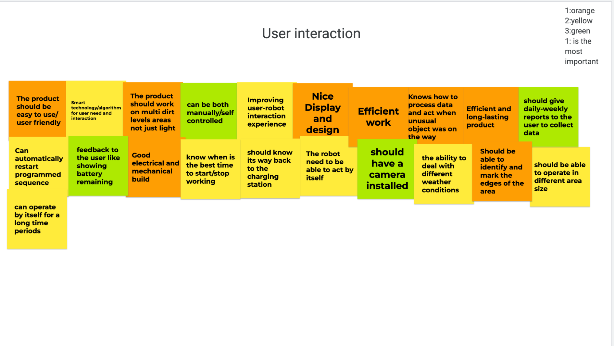  
  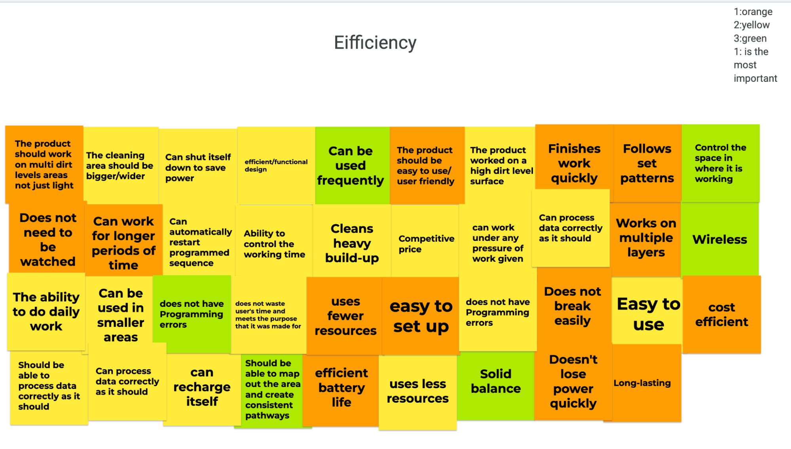  
  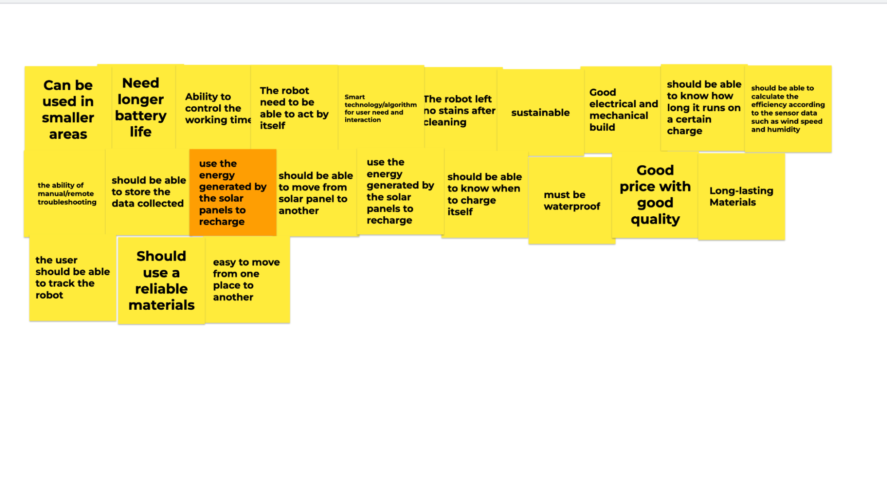  

Figure 7 - Grouped user needs
 

</figure>

## 

## **User Needs and Benchmarking Assessment**

At the end of our user needs and benchmarking process we are moving to
the product requirements section. It was important to understand the
concepts on every product that we benchmarked. So based on what our
outcome in the user needs is determining the main requirements of our
product. Overall the steps are becoming more clear for the team to
choose the main challenge we are going to solve.

## **2.2 Product Requirements**

In the product requirement we converted the most ranked needs into
requirements to our project.

**Introduction**

Today renewable energy is playing a huge role in saving the planet and
also acknowledging people about nature. In this project, our team is
going to build a functional robot to sense dust, temperature, and
humidity, and take action to clean any solar panel or tool that needs
regular cleaning for efficiency. Most of us are not aware of how solar
panels play a huge role in reducing the footprint pollution around the
world. As a team we decided to focus and solve a challenge that will
increasingly affect the usage of solar panels.

The project mainly aims to sense and collect data based on how efficient
are solar panels and compare the efficiency before and after the
cleaning. Moreover, it aims to support and increasingly affect solar
panel users and new customers.

**Objectives**

Our project aims to spread the culture of solar panels and make them
more efficient for old and new users. Our main goal is to build an
easy-to-set-up, lightweight, and good-quality solar panel cleaner that
reacts fast whenever it feels a certain quantity of dust. On the other
hand, it will be featured with different sensors such as temperature,
and humidity sensors.

**Stakeholders**

**Target group**

Our target group is the people that have solar panels installed in their
home/company or those looking to install solar panels in the near
future.

**Target purchaser**

Target group profile with attention given to farmers, home-owners and
companies.

**Customer service**

We are aiming to provide good instructions and answers to the most
common questions with the product. Moreover, we are aiming to provide
good quality materials and an easy-to-set-up product.

**Retailers**

Retailers might oversee the projects at the showcase and endorse them to
their company for selling to the public.

**Use Cases**

**User Story \#1: Derock**

Derock is a 52-year-old farmer from the Midwest that wakes up before
sunrise and finishes after sunset. He just recently bought solar panels
to help reduce electricity costs and keep tools charged up for the day.
He is not that technology savvy, but has found that SolarXCL is easy to
use and maintain. When he’s working throughout the day, he knows that he
is getting the maximum efficiency his solar panels will allow. This lets
him work uninterrupted for more productive days.

Occasionally storms will pass through the area and kick-up dirt and mix
with the rainfall to make mud that covers the panels. Derrick has his
SolarXCL setup to automatically detect the newly added grime. When the
storm passes, SolarXCL will clean off the panels again giving Derrick
peace of mind.

**User Story \#2: Vianna**

Vianna is a 36-year-old mother of three. She has two children currently
in primary school, and the third is a toddler still at home. The family
recently got solar panels installed for their home to reduce their
monthly power costs. During the day Vianna takes care of various house
chores, and takes care of the toddler. She likes to unwind by watching
shows or movies on Netflix. She has set up her SolarXCL to detect larger
dirt-piles to make sure it gets cleaned off so their power efficiency is
always as high as possible. This removes one task for her and lets the
family enjoy extra movie nights with the money saved.

The ease-of-use of SolarXCL has made Vianna fall in love with it. She
tells all her friends and neighbors about the product if they ever
choose to get solar panels installed. She has become a long-term
customer.

**User Story \#3: Kei**

Kei is the CEO of a technology company; in one of the tropical countries
he turned his company into an eco-friendly system. He mainly insisted
and focused on having solar panels to power electricity into his
company. During winter and summer seasons he noticed that the AC is not
cooling or heating fast so he asked his team to check the solar system
in his company. Once they did, they saw how some panels were uncleaned
and obviously not efficiently working. He looked online and found our
product SolarXCL. He noticed how the cooling system improved.

**Aspects**

1.  > **Product Design**

> 1.1 The product is build with high quality materials
> 
> 1.2 The product is easy to set up
> 
> 1.3 The product has good appearance
> 
> 1.4 The product has creative features compared to the ones in the
> market
> 
> 1.5 The product will sense the dust, temperature and humidity
> 
> 1.6 The Product will work with battery
> 
> 1.7 The product has good stability

2.  > **Functionality**

> 2.1 The product needs software programming to achieve the required
> mission of cleaning the solar panels.
> 
> 2.2 The product will sense different things and that will be done
> through an open-source code.
> 
> 2.3 The product should not require complicated instructions or coding.
> 
> 2.4 The product will be able to work manually

3.  > **Interactivity**

> 3.1 The product will work wirelessly with a mobile application.
> 
> 3.2 The product shall be adjusted to clean at regular intervals if the
> customer chooses.
> 
> 3.3 The user interface will be intuitive for all users after a few
> minutes of use.

4.  > **Adaptive Intelligence**

> 4.1 The product shall detect when a layer of debris has built-up on
> the solar panels and clean it off.
> 
> 4.2 The product will detect if it will rain or is raining based on
> current humidity and cease functions until it clears.

5.  > **Customization**

> 5.1 The product will be height adjustable for different solar panels.
> 
> 5.2 The product will be adjustable to clean surfaces of differing
> weather and environmental conditions.

6.  > **Manufacturing**

> 6.1 The total cost of the product will be ≤ $60.
> 
> 6.2 The product will be designed to assemble in under three hours.
> 
> 6.3 The product will avoid use of toxic waste.

7.  > **Safety**

> 7.1 The product will be waterproof to avoid any electricity touch
> 
> 7.2 The product will be small and light to avoid any accidents and to
> make it easy to move
> 
> 7.3 The product will be stuck and well attached to the solar panel

**Open Questions**

  - > How can we make the product more cost effective?

  - > How can we make the robot more energy efficient?

  - > How can the robot be more environmentally friendly?

  - > How can we give the user better user interaction with the robot?

  - > What would be the best technique for controlling the robot?

> ·

## **Product requirement Assessment** 

Overall, the product requirement made our team focus more into solar
panels challenges. Moreover, the seven categories helped intentionally
in building the requirements of our final product. The categories Design
Product, Functionality, Adaptive Intelligence, Interactivity,
Manufacturing, Customization and Safety are our project main focus.
After the process of product requirement we moved into brainstorming
designs ideas and features.

# **3.0 Design Ideation** 

## **3.1 Background and Steps** 

The purpose of these steps is to maximize the number of ideas for our
final product. Using this process we are aiming to get three main
concepts. We started by brainstorming all the ideas, features and styles
of our projects. After that, we categorized the different ideas into
four main categories which are environmental, daily life helper, farmers
and common features . Moreover, we colored every category differently in
order to make it easy to track every idea. Next we ranked all the ideas
in a scale from one to three with one being the most important and three
being the least important. Finally, we started designing our concepts
based on our top ranked ideas.

## **3.2 Brainstorming Steps and Ideas** 

We brainstormed about 100 ideas and project concepts by thinking about
the required features that we generated from the user needs list. We
started with three different empty boards and started to fill them with
the concepts/ideas sticky notes.

<figure class="image">  

  

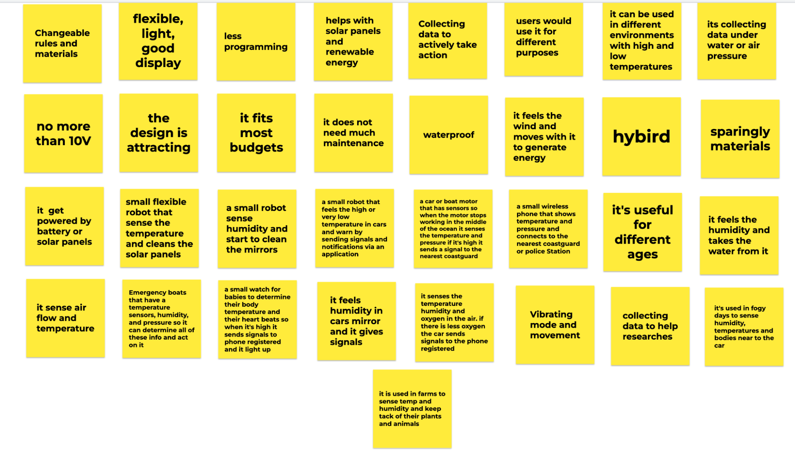   
  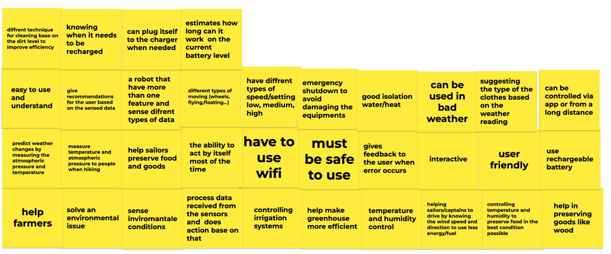 
  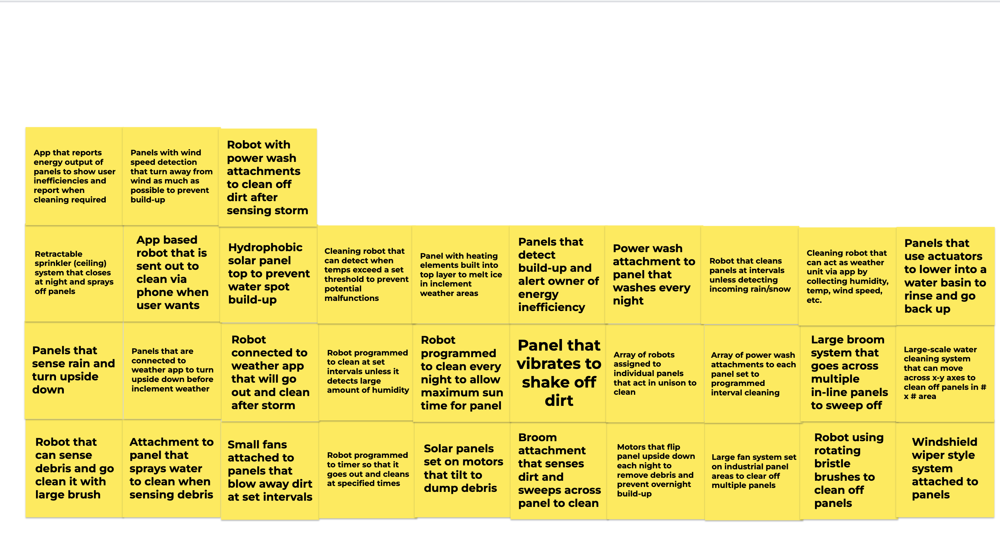 
  

Figure 7 - Design Ideation

</figure>

  - > **Grouping**

After brainstorming our ideas we grouped them into the following four
different colors:

**Table 11. Grouping Key**

| Pink   | Daily Life Ideas |
| ------ | ---------------- |
| Green  | Environmental    |
| Yellow | Farmers Help     |
| Blue   | Common Features  |

<figure class="image">  

  

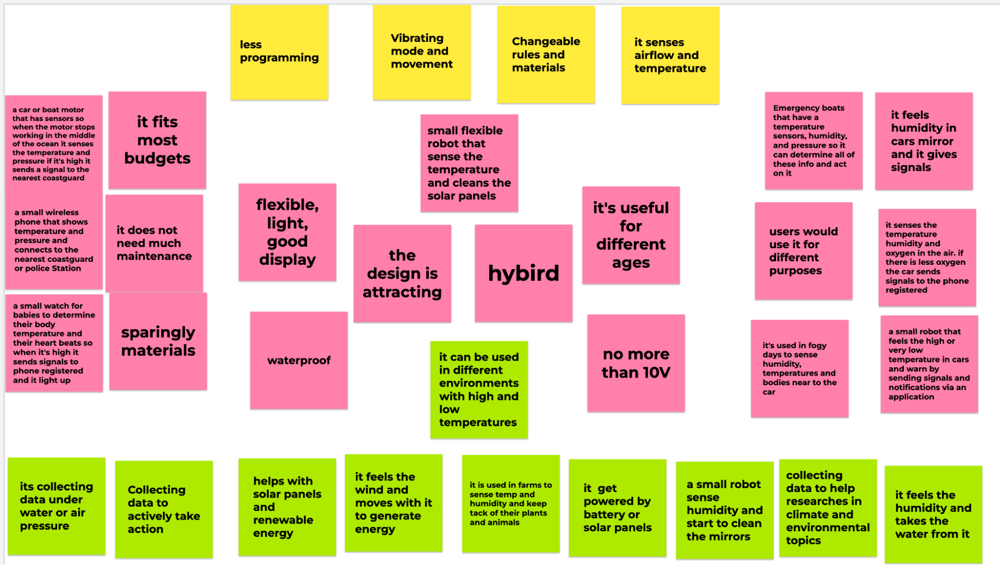 
  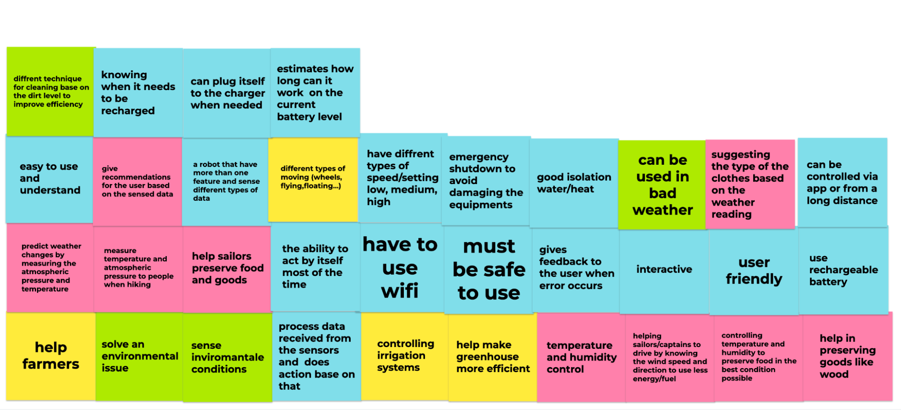 
  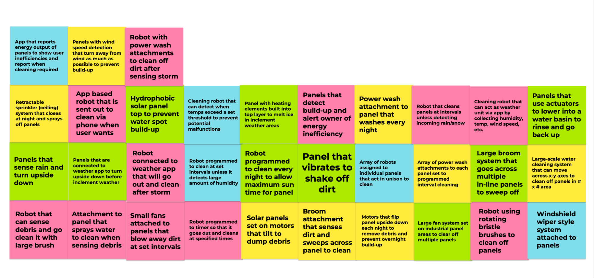 

Figure 8 - Grouped Ideas 

</figure>

  - > **Ranking**

Then, we moved every group of ideas to their own slide and ranked them
according to the importance level and requirements for the project with
number one being the most important.

<figure class="image">  

  

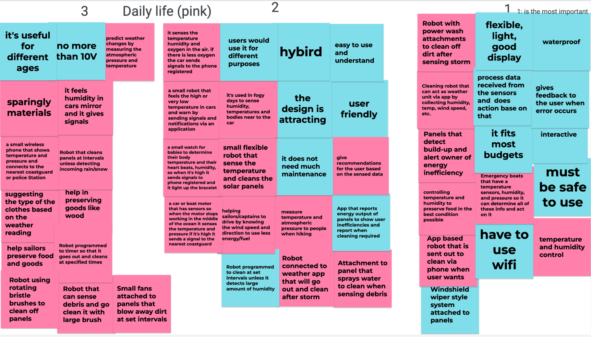 
  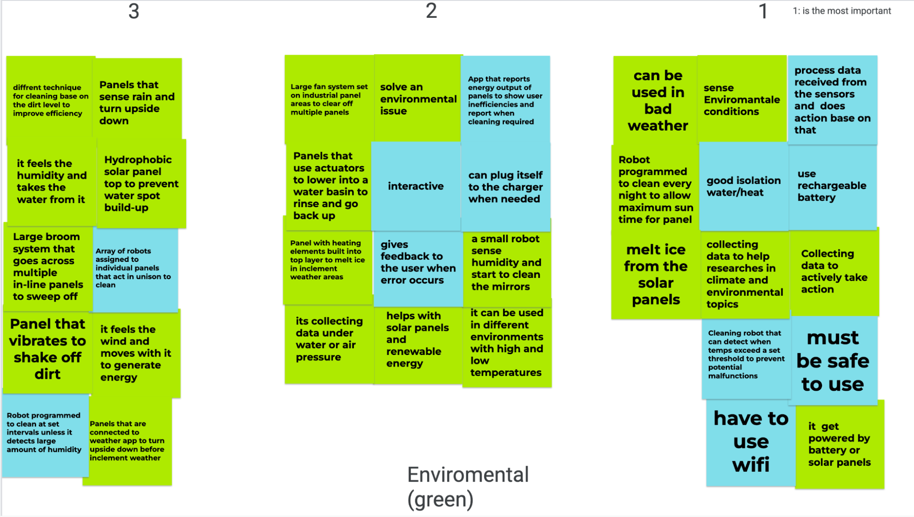 
  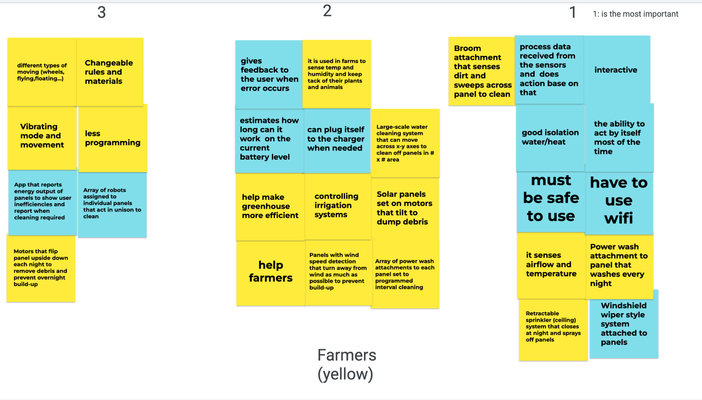 

Figure 9 - Ranked Ideas  

</figure>

## **3.3 Product Concept Sketches** 

**Design concept \#1**

The concept behind this design is to provide the market with fully
equipped and ready to use solar panels. It has sensors to detect the
dust, temperature and humidity. When it detects a certain amount of
humidity or dust it sends signals to the washer system, and the whole
system collaborates to get rid of the extra water and dust. This design
is effective and full of different features.

<figure class="image">  

  

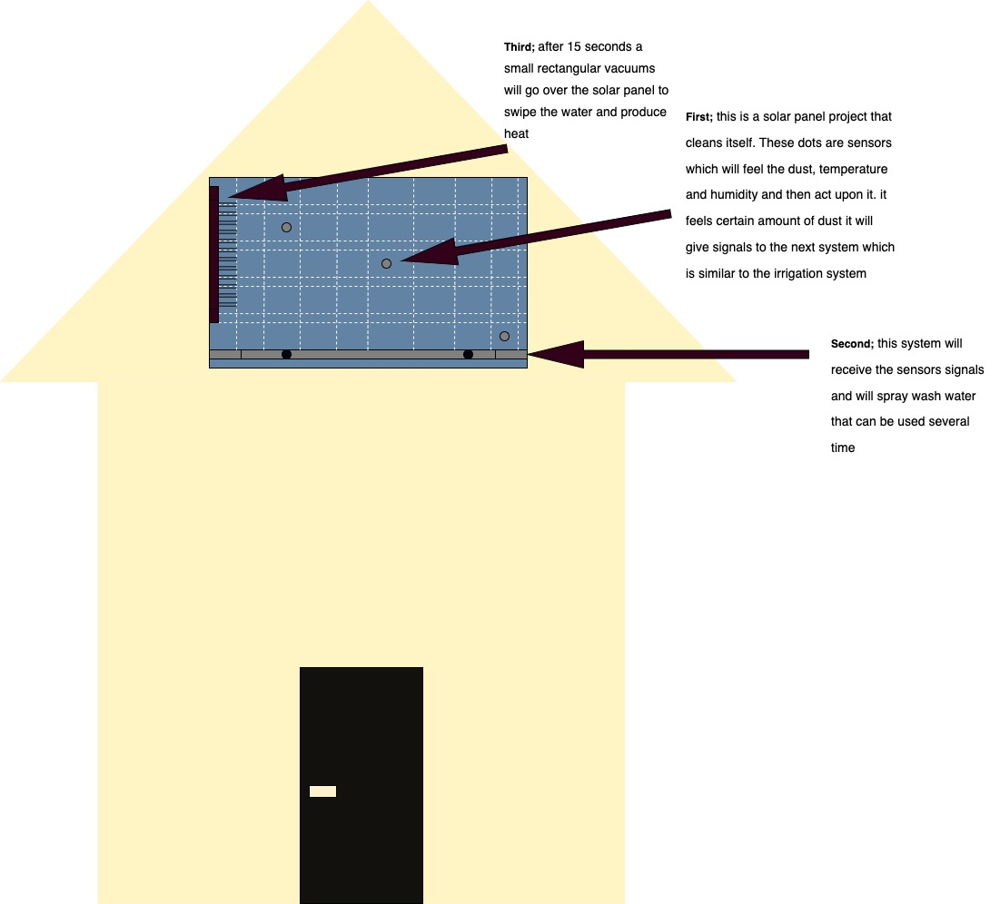   

Figure 10 - First Product Concept   

</figure>

**Design Concept \#2**

The idea of this concept is a heat emitting robot that moves on the
solar panels after a snow storm to melt the snow from the roof to. When
the robot reads the temperature and wind speed that indicate the end of
the storm for it to start to warm up and melt the snow. It also has a
charging station that is powered by solar panels. 
<figure class="image">  

  

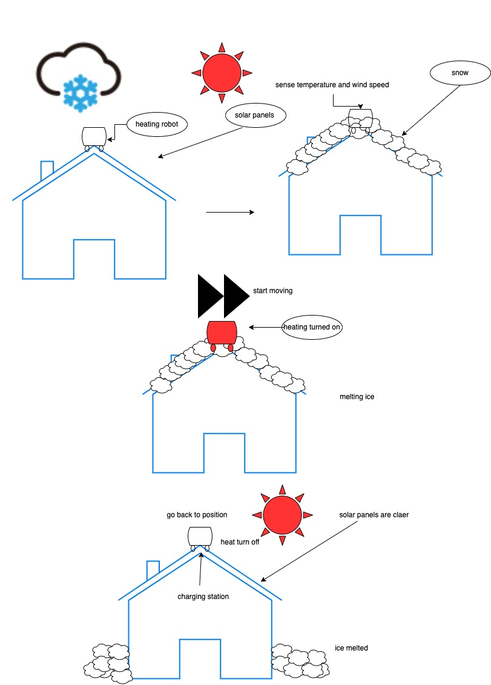   

Figure 10 - Second Product Concept   

</figure>

**Design Concept \#3**

A nylon brush attached to a motor and fixture to sweep across a solar
panel. The controller is located underneath the panel and works in
tandem with a humidity sensor and wind speed sensor. This lets the
controller decide a good time to clean based on whether rain is likely
or high winds have blown more dust and debris onto the
panel.
<figure class="image">  

  

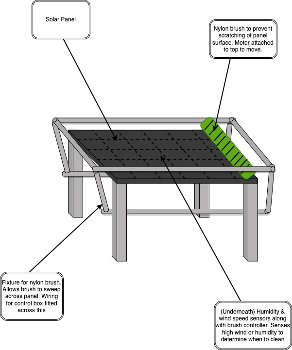   

Figure 12 - Third Product Concept   

</figure>

**Design Ideation Assessment**

Overall, the team now has a clear idea of what the final project will
look and function like. The step of design ideation made all of us on
the same page while we were brainstorming and designing. Finally we are
looking for more feedback to make the final decision.

# **4.0 Appendix** 

## **Table 12. Communication Channels**

| **Name**            | **First Choice Communication** | **Second Choice Communication** | **Third Choice Communication** |
| ------------------- | ------------------------------ | ------------------------------- | ------------------------------ |
| Fatema Alshehhi     | *Discord*                      | *WhatsApp*                      | *Messages*                     |
| Sivanee Naghichetty | *Discord*                      | *WhatsApp*                      | *Messages*                     |
| Timothy Drafz       | *Discord*                      | *Messages*                      | *WhatsApp*                     |
| Salsabil Soliman    | *Discord*                      | *WhatsApp*                      | *Messages*                     |

## **Communication Procedures**

Communication between group members will take place on Discord. Thus,
the team will regularly meet and discuss any updates and plan their
assignments outline and goals. Moreover, the team will email the
professor as a communication method with the instructor for guidance and
inquiries. Zoom/Discord meetings will also be held for updates or quick
weekday meetups.

## **Meeting Schedule**

Our team availability can be found through this
[link](https://docs.google.com/spreadsheets/u/1/d/1qsL_EHei7h-eo-5rombT-5g8ybxEDRhG_eKkYWFzCa4/edit).
Initially, we are planning to meet Fridays from 3:00 PM until 5:00 PM.
However, our team will try to discuss and work all the main agenda
through the class time. Additionally, we will hold zoom/Discord meetings
on weekdays to discuss any updates and plan in-person meetings.

**Meeting Coordination**

  - > We are going to remind each other by the meetings through discord.

  - > The meeting time is based on the [schedule
    > of
    > availability](https://docs.google.com/spreadsheets/u/1/d/1qsL_EHei7h-eo-5rombT-5g8ybxEDRhG_eKkYWFzCa4/edit)
    > and discussions at least a week before.

  - > Our preferred meeting methode is online through discord/zoom if no
    > in-person work is required.

  - > Team members need to notify the team if there were any changes to
    > their availability schedule to ensure that we are all attending
    > the meetings on time.

## **Team Coordination**

  - > We set an earlier due date which ranges between 4-24 hours before
    > the actual due date and make sure that every team member is
    > checked off by the time that we set it.

  - > We will ask every team member about their knowledge and what part
    > do they think they can do the best based on previous semesters
    > projects or any projects that they did before.

  - > The assignments will be reviewed and validated by each team member
    > before submission to ensure that we have everything as it should
    > be.

## **Table 13.Roles and Responsibilities** 

| **Role**          |                  | **Duties**                                                                                                                                |
| ----------------- | ---------------- | ----------------------------------------------------------------------------------------------------------------------------------------- |
| Meeting leader    | Salsabil Soliman | Schedules team meetings, creates and distributes an agenda for each meeting, and runs each meeting                                        |
| Meeting recorder  | Sivanee          | Takes minutes of each team meeting, including attendance, and records action items and to whom they are assigned                          |
| Assignment leader | Timothy          | Coordinates the team’s work on a given assignment to Canvas before the due date                                                           |
| Project monitor   | Fatema           | Tracks the team’s progress relative to the project schedule (Gantt chart) and keeps team members apprised of deadlines and project status |

## **How will you assign technical responsibilities to the team members?**

Responsibilities will be discussed among the team members and strengths
will be noted. If no member is strong in an area required by the
project, a team member will be assigned that duty with the expectation
of help from other team members. They will be expected to learn enough
about the responsibility to perform it through the semester.

## **User needs list**

1.  > The product should be easy to use/ user friendly

2.  > The product should work on multi dirt levels areas not just light

3.  > The cleaning area should be bigger/wider

4.  > Would be better if it need replacement after working for a longer
    > time

5.  > The product worked on a high dirt level surface

6.  > Improving user-robot interaction experience

7.  > Cleaning product/water spray

8.  > Can be used frequently

9.  > Efficient/functional design

10. > Can shut itself down to save power

11. > Nice Display and design

12. > Efficient and long-lasting product

13. > Good electrical and mechanical build

14. > the cleaning area should be bigger/wider

15. > Smart technology/algorithm for user need and interaction

16. > Improving user-robot interaction experience

17. > The robot need to be able to act by itself

18. > The robot left no stains after cleaning

19. > Easy to maintain

20. > Should be able to map out the area and create consistent pathways

21. > Easy to use

22. > Works on multiple layers

23. > Follows set patterns

24. > Can be manually operated

25. > Can automatically restart programmed sequence

26. > Ability to control the working time

27. > Competitive price

28. > Should be able to process data correctly as it should

29. > Efficient battery life

30. > The robot need to be able to act by itself

31. > Does not need to be watched

32. > Can work for longer periods of time

33. > Cleans heavy build-up

34. > Can reach high places safely

35. > Can recharge itself

36. > Does not break easily

37. > Can be used in smaller areas

38. > Long-lasting

39. > Wireless

40. > Finishes work quickly

41. > Need longer battery life

42. > Efficient battery use

43. > Control the space in where it is working

44. > Knows how to process data and act when unusual object was on the
    > way

45. > Ability to control the working time

46. > Cost efficient

47. > Solid balance

48. > Does not corrupt/damage the surface

49. > Doesn't lose power quickly

50. > Have to work on different environment/surface

51. > Can work under any pressure of work given

52. > Feedback to the user like showing battery remaining

53. > Does not waste user's time and meets the purpose that it was made
    > for

54. > Sustainable

55. > Uses fewer resources

56. > Easy to set up

57. > Can process data correctly as it should

58. > Does not have Programming errors

59. > Efficient work

60. > The ability to do daily work

61. > Should have a camera installed

62. > have an emergency shutdown option

63. > The ability of manual/remote troubleshooting

64. > Can be both manually/self controlled

65. > should be able to move from solar panel to another

66. > should know its way back to the charging station

67. > should be able to know when to charge itself

68. > should be able to know how long it runs on a certain charge

69. > should be able to calculate the efficiency according to the sensor
    > data such as wind speed and humidity

70. > should be able to operate in different area size

71. > should give daily-weekly reports to the user to collect data

72. > should be able to store the data collected

73. > is safe to use

74. > use the energy generated by the solar panels to recharge

75. > know when is the best time to start/stop working

76. > easy to move from one place to another

77. > can operate by itself for a long time periods

78. > needs lees human supervision

79. > the ability to deal with different weather conditions

80. > should have a good electrical isolation for safety purposes

81. > must be waterproof

82. > the user should be able to track the robot

83. > Good price with good quality

84. > Long-lasting Materials

85. > Works under worst circumstances and has good features

86. > Should not miss areas and be able to clean the entire surface

87. > The cleaning patterns should be improved/smarter

88. > The prices should be reasonable for the technology and services it
    > provides

89. > Should be able to move in any direction needed

90. > Should use a reliable materials

91. > Should be able to operate efficiently in various conditions

92. > easy to maintain

93. > Should be able to identify and mark the edges of the area

94. > It does not need regular maintenance

95. > The algorithm/coding need to be fixed as it gets stuck/confused
    > against simple linear surfaces/ should be able to clearly identify
    > the path

96. > It does the job accurately and takes actions fast

97. > Good set up process

98. > Good instructions and make it as simple as possible

99. > It should states how to be used in different environment with good
    > instructions

100. > Customer services that is aware of common issues between users to
     > answer questions or common questions answered on the instruction
     > paper

101. > It should have high sensing and accurately does it job

102. > Easy to use and understand

## **Our Team Milestones**

Concept presentation: 1/23/2023

Design presentation: 2/22/2023

Design freeze: 3/24/2023

Planned release: 4/28/2023

