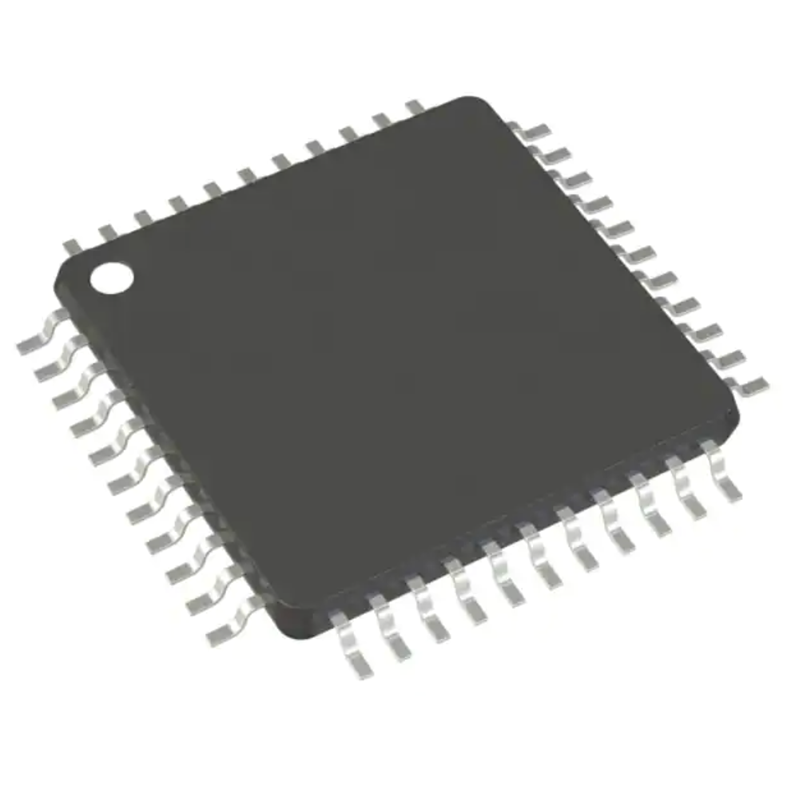

# **6.0 Microcontroller Selection**

> Our selected microcontroller is PIC16LF15376. We chose all of our
> project components based on three categories which are, quality,
> availability, and price. PIC16LF15376 was the best choice in the
> market and it met all of the requirements and the team criteria.
> Please take a look below to see the features of our microcontroller.

<table>
<colgroup>
<col style="width: 35%" />
<col style="width: 37%" />
<col style="width: 27%" />
</colgroup>
<thead>
<tr class="header">
<th><strong>Solution</strong></th>
<th><strong>Pros</strong></th>
<th><strong>Cons</strong></th>
</tr>
<tr class="odd">
<th><blockquote>

</blockquote>

PIC16LF15376

Part <strong>No.</strong>

PIC16LF15376-I/PT

<strong>Price:</strong> 1.85$

<a href="https://www.digikey.com/en/products/detail/microchip-technology/PIC16LF15376-I-PT/7164824"><u>Link</u></a>
</th>
<th><ul>
<li><blockquote>

High performance

</blockquote></li>
<li><blockquote>

Low power consumption

</blockquote></li>
<li><blockquote>

Low cost

</blockquote></li>
<li><blockquote>

MCC

</blockquote></li>
<li><blockquote>

Available for delivery

</blockquote></li>
</ul></th>
<th><ul>
<li><blockquote>

Limited availability of third-party libraries

</blockquote></li>
<li><blockquote>

Limited peripheral options

</blockquote></li>
</ul></th>
</tr>
</thead>
<tbody>
</tbody>
</table>

## **Microcontroller Selection** 

<table>
<colgroup>
<col style="width: 25%" />
<col style="width: 41%" />
<col style="width: 10%" />
<col style="width: 11%" />
<col style="width: 11%" />
</colgroup>
<thead>
<tr class="header">
<th colspan="2"><strong>1. Determine your project-specific requirements</strong></th>
<th colspan="3"><strong>3. Look up specifications in the PIC datasheet</strong></th>
</tr>
<tr class="odd">
<th><strong>Design Considerations</strong></th>
<th>
<strong>Team Project-Specific Requirements</strong>

from Problem Definition and Block Diagram
</th>
<th><strong>PIC Option 1</strong></th>
<th><strong>PIC Option 2</strong></th>
<th><strong>PIC Option 3</strong></th>
</tr>
<tr class="header">
<th>How many GPIO Pins?<a href="#fn1" class="footnote-ref" id="fnref1" role="doc-noteref">1</a></th>
<th>Two at minimum with four recommended.</th>
<th><strong>5</strong></th>
<th><strong>64</strong></th>
<th><strong>36</strong></th>
</tr>
<tr class="odd">
<th>Built-in Analog to Digital Converter? How many?</th>
<th>Needs 1 ADC with multiple outputs.</th>
<th><strong>1</strong></th>
<th><strong>1</strong></th>
<th><strong>1</strong></th>
</tr>
<tr class="header">
<th>Built-in Hardware PWM? How many?</th>
<th></th>
<th><strong>1</strong></th>
<th><strong>0</strong></th>
<th><strong>2</strong></th>
</tr>
<tr class="odd">
<th>Built-in I2C? SPI? How many?</th>
<th>Does not need I2C or SPI.</th>
<th><strong>1</strong></th>
<th><strong>2</strong></th>
<th>
<strong>SPI- 1</strong>

<strong>I2C- 1</strong>
</th>
</tr>
<tr class="header">
<th>Built-in UART? How many?</th>
<th>Needs built-in UART. Two pins for RX/TX.</th>
<th><strong>1</strong></th>
<th><strong>2</strong></th>
<th><strong>2</strong></th>
</tr>
<tr class="odd">
<th>Other Required Built-In Features? <em>(optional)</em></th>
<th></th>
<th></th>
<th></th>
<th></th>
</tr>
<tr class="header">
<th>Additional considerations specific to your project specifications <em>(optional)</em></th>
<th></th>
<th></th>
<th></th>
<th></th>
</tr>
<tr class="odd">
<th colspan="2"><strong>2. Find 3 microcontrollers that meet your team project-specific requirements and find information on each</strong></th>
<th colspan="3"><strong>4. Look up part details in the PIC datasheet</strong></th>
</tr>
<tr class="header">
<th><strong>Microcontroller Considerations</strong></th>
<th><strong>Instructions</strong></th>
<th><strong>PIC Option 1</strong></th>
<th><strong>PIC Option 2</strong></th>
<th><strong>PIC Option 3</strong></th>
</tr>
<tr class="odd">
<th>Part Number<a href="#fn2" class="footnote-ref" id="fnref2" role="doc-noteref">2</a></th>
<th><em>Include the entire part number (leave off any letters at the end that specify the package type)</em></th>
<th><strong>PIC18F23K20</strong></th>
<th><strong>PIC24EP512GP206</strong></th>
<th><strong>PIC16LF15376</strong></th>
</tr>
<tr class="header">
<th>Link (URL) to product page</th>
<th><em>Do not paste links directly into the table. Instead, <a href="http://www.microchip.com/"><u>link them like this</u></a>.</em></th>
<th><a href="https://www.microchip.com/en-us/product/PIC18F23K20"><strong><u>Product</u></strong></a></th>
<th><a href="https://www.microchip.com/en-us/product/PIC24EP512GP206"><strong><u>Product</u></strong></a></th>
<th><a href="https://www.digikey.com/en/products/detail/microchip-technology/PIC16LF15376-I-PT/7164824"><strong><u>Product</u></strong></a></th>
</tr>
<tr class="odd">
<th>Links (URL) to Data Sheets</th>
<th></th>
<th><a href="https://ww1.microchip.com/downloads/aemDocuments/documents/OTH/ProductDocuments/DataSheets/40001303H.pdf"><strong><u>Data</u></strong></a></th>
<th><a href="https://ww1.microchip.com/downloads/aemDocuments/documents/MCU16/ProductDocuments/DataSheets/dsPIC33EPXXXGP50X-dsPIC33EPXXXMC20X-50X-and-PIC24EPXXXGP-MC20X-Family-Data-Sheet-DS70000657J.pdf"><strong><u>Data</u></strong></a></th>
<th><a href="https://ww1.microchip.com/downloads/aemDocuments/documents/MCU08/ProductDocuments/DataSheets/PIC16%28L%29F15356-75-76-85-86-Data-Sheet-40001866.pdf"><strong><u>Data</u></strong></a></th>
</tr>
<tr class="header">
<th>Links (URL) to Application Notes</th>
<th><em>Often provided by manufacturers to give you specific examples of how to use their products. Search for them in the search bar on the Microchip’s website.</em></th>
<th>
<a href="https://ww1.microchip.com/downloads/en/Appnotes/00001267b.pdf"><strong><u>Low Power</u></strong></a>

<a href="https://ww1.microchip.com/downloads/en/Appnotes/Microchip-AN1921-8-bit-PICMCU-TCP-IP-LiteStack-ApplicationNote-00001921D.pdf"><strong><u>TCP/IP Lite Stack</u></strong></a>
</th>
<th><strong>No application notes found</strong></th>
<th>
<strong>No application notes</strong>

<strong>found</strong>
</th>
</tr>
<tr class="odd">
<th>Links (URL) to Code Examples</th>
<th></th>
<th><a href="https://ww1.microchip.com/downloads/aemDocuments/documents/OTH/ProductDocuments/CodeExamples/PIC18_SPI_Examples.zip"><strong><u>Code</u></strong></a></th>
<th><a href="https://ww1.microchip.com/downloads/aemDocuments/documents/OTH/ProductDocuments/CodeExamples/ce400_adc_iir_filter.zip"><strong><u>Code</u></strong></a></th>
<th><a href="https://ww1.microchip.com/downloads/aemDocuments/documents/MCU08/ProductDocuments/DataSheets/PIC16%28L%29F15356-75-76-85-86-Data-Sheet-40001866.pdf"><strong><u>Code Page 245</u></strong></a></th>
</tr>
<tr class="header">
<th>Links (URL) to External Resources</th>
<th><em>Search on Google and YouTube for other resources for each specific microcontroller.</em></th>
<th><a href="https://www.youtube.com/watch?v=NKndFFVE0ho"><strong><u>Signal Receiver</u></strong></a></th>
<th><a href="https://www.microchip.com/en-us/product/PIC24F08KM202"><strong><u>Resources</u></strong></a></th>
<th><a href="https://www.microchip.com/en-us/tools-resources/develop/mplab-x-ide"><strong><u>Resources</u></strong></a></th>
</tr>
<tr class="odd">
<th>Production Unit Cost</th>
<th><em>Find in the Microchip online store, or Digikey</em></th>
<th><strong>$2.15</strong></th>
<th><strong>$6.06</strong></th>
<th><strong>$1.85</strong></th>
</tr>
<tr class="header">
<th>Supply Voltage Range</th>
<th><em>Find in the microcontroller datasheet</em></th>
<th><strong>1.8-3.6V</strong></th>
<th><strong>3-3.6v</strong></th>
<th><strong>1.5-5.5 V</strong></th>
</tr>
<tr class="odd">
<th>Absolute Maximum Current for entire IC</th>
<th><em>Find in the microcontroller datasheet</em></th>
<th><strong>350mA</strong></th>
<th><strong>300mA</strong></th>
<th><strong>200mA</strong></th>
</tr>
<tr class="header">
<th>Maximum GPIO Pin Current (Source/Sink)</th>
<th><em>Find in the microcontroller datasheet</em></th>
<th><strong>50mA</strong></th>
<th><strong>200mA</strong></th>
<th><strong>±25mA</strong></th>
</tr>
<tr class="odd">
<th>8-bit or 16-bit Architecture</th>
<th><em>Find in the microcontroller datasheet</em></th>
<th><strong>16-bit</strong></th>
<th><strong>16-bit</strong></th>
<th><strong>8-bit</strong></th>
</tr>
<tr class="header">
<th>Available IC Packages / Footprints</th>
<th><em>Find in the microcontroller datasheet. Choose a microcontroller with both surface mount and DIP/through-hole packages available. See Most Common Mistakes below for requirements to improve manufacturing reliability.</em></th>
<th><strong>Footprint creation data given for SOIC, DIP, and other packags<a href="https://www.microchip.com/en-us/support/package-drawings"><u>Website</u></a></strong></th>
<th><strong>MA330030</strong></th>
<th><strong>Yes</strong></th>
</tr>
<tr class="odd">
<th>Supports External Interrupts?</th>
<th><em>Find in the microcontroller datasheet</em></th>
<th><strong>Yes</strong></th>
<th><strong>Yes</strong></th>
<th><strong>Yes</strong></th>
</tr>
<tr class="header">
<th>In-System Programming Capability and Type</th>
<th><em>Allows for programming the microcontroller without removing it from the PCB. Find in the microcontroller datasheet.</em></th>
<th><strong>Yes</strong></th>
<th><strong>Yes</strong></th>
<th><strong>Yes</strong></th>
</tr>
<tr class="odd">
<th>Programming Hardware, Cost, and URL</th>
<th><em>Find on the microcontroller product page</em></th>
<th>
<a href="https://www.microchip.com/en-us/development-tool/DV007004"><strong><u>Hardware</u></strong></a>

<strong>$1,183.59</strong>
</th>
<th>
<a href="https://www.microchip.com/en-us/development-tool/DV007004"><strong><u>Hardware</u></strong></a>

<strong>$1,183.59</strong>
</th>
<th>
<a href="https://www.microchip.com/en-us/development-tool/DV007004"><strong><u>Hardware</u></strong></a>

<strong>$1,183.59</strong>
</th>
</tr>
<tr class="header">
<th>Works with <a href="https://www.microchip.com/mplab/mplab-x-ide"><u>MPLAB® X Integrated Development Environment</u></a> (IDE)?</th>
<th><em>Required. See <a href="https://www.microchip.com/development-tools"><u>Microchip Development Tools</u></a></em></th>
<th><strong>Yes</strong></th>
<th><strong>Yes</strong></th>
<th><strong>Yes</strong></th>
</tr>
<tr class="odd">
<th>Works with <a href="https://www.microchip.com/mplab/mplab-code-configurator"><u>Microchip Code Configurator</u></a>?</th>
<th><em>Required. Go to the <a href="https://www.microchip.com/en-us/tools-resources/configure/mplab-code-configurator"><u>MCC website</u></a>, click the “Manual Downloads” tab, scroll to the device library that goes with the PIC you chose (likely “MCC 8-bit PIC”) and read the release notes to make sure your microcontroller is in the list of supported devices.</em></th>
<th><strong>Yes</strong></th>
<th><strong>Yes</strong></th>
<th><strong>Yes</strong></th>
</tr>
</thead>
<tbody>
</tbody>
</table>
<section class="footnotes footnotes-end-of-document" role="doc-endnotes">

<ol>
<li id="fn1" role="doc-endnote">
No PIC16F887, PIC16F917, PIC18F47Q10, or dsPICs allowed
</li>

</ol>
</section>

<table>
<colgroup>
<col style="width: 25%" />
<col style="width: 32%" />
<col style="width: 15%" />
<col style="width: 10%" />
<col style="width: 15%" />
</colgroup>
<thead>
<tr class="header">
<th colspan="5"><strong>5. Write overall pros, cons, and rankings for the chosen microcontrollers</strong></th>
</tr>
<tr class="odd">
<th><strong>Overall Pros</strong></th>
<th><em>Write at least 2 for each microcontroller</em></th>
<th>
<strong>1) Exceeds project req’s</strong>

<strong>2) Not expensive</strong>
</th>
<th>
<strong>1) Have the greatest memory</strong>

<strong>2) Have the most number of pins</strong>
</th>
<th>
<strong>1)High performance</strong>

<strong>2)Low power consumption</strong>

<strong>3)Affordable</strong>
</th>
</tr>
<tr class="header">
<th><strong>Overall Cons</strong></th>
<th><em>Write at least 2 for each microcontroller</em></th>
<th>
<strong>1) Limited voltage range</strong>

<strong>2) Only 1 set of EUSART paired pins</strong>
</th>
<th>
<strong>1) Most expensive</strong>

<strong>2) Doesn’t have pwm</strong>
</th>
<th>
<strong>1) Limited availability of third-party libraries</strong>

<strong>2) Limited peripheral options</strong>
</th>
</tr>
<tr class="odd">
<th><strong>Ranking</strong></th>
<th><em>1 = first, 2 = second, 3 = third</em></th>
<th><strong>3</strong></th>
<th><strong>2</strong></th>
<th><strong>1</strong></th>
</tr>
</thead>
<tbody>
</tbody>
</table>

**6. Final Microcontroller Choice**: Our final choice is
**PIC16LF15376**

**Rationale**: It has all the requirements that we need for our final
project and it has enough URAT and memory.
