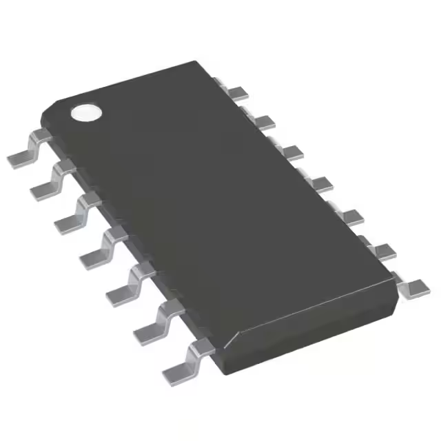

# **6.0 Microcontroller Selection**

Our selected microcontroller is PIC16F15323T-I/SL. We chose all of our
project components based on three categories which are, quality,
availability and price. PIC16F15323T-I/SL was the best choice in the
market and it met all of the requirements and the team criteria. Please
take a look below to see the features of our microcontroller.

<table>
<colgroup>
<col style="width: 35%" />
<col style="width: 37%" />
<col style="width: 27%" />
</colgroup>
<thead>
<tr class="header">
<th><blockquote>

</blockquote>

PIC16F15323T-I/SL

Part <strong>No.</strong>

PIC16F15323T-I/SLTR-ND

<strong>Price:</strong> 0.99$

<a href="https://www.digikey.com/en/products/detail/microchip-technology/PIC16F15323T-I-SL/7203701"><u>Datasheet</u></a>
</th>
<th><ul>
<li><blockquote>

High performance

</blockquote></li>
<li><blockquote>

Low power consumption

</blockquote></li>
<li><blockquote>

Low cost

</blockquote></li>
<li><blockquote>

MCC

</blockquote></li>
<li><blockquote>

Available for delivery

</blockquote></li>
</ul></th>
<th><ul>
<li><blockquote>

Limited availability of third-party libraries

</blockquote></li>
<li><blockquote>

Limited peripheral options

</blockquote></li>
<li><blockquote>

Small number of pins

</blockquote></li>
</ul></th>
</tr>
</thead>
<tbody>
</tbody>
</table>
