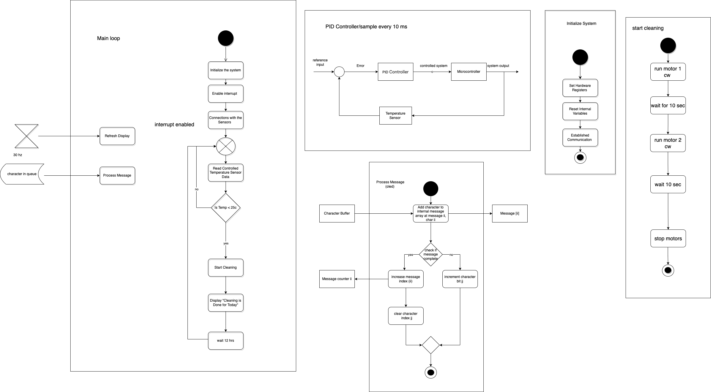

# **7.0 Software Implementation**

The software diagram provides a clear representation of how our software will function in order to meet the user needs and product requirements. The main loop of the software is responsible for the initialization, interrupt enable, and the logic of the code. The temperature sensor is used to measure the temperature and if it reaches 25°C, the motors are activated to start the cleaning process. Motor 1 is used to brush vertically to clean the solar panel. This functionality satisfies the user needs by providing a self-cleaning mechanism that can keep the solar panels clean and improve their efficiency. Additionally, the software meets the product requirements by automating the cleaning process and eliminating the need for manual cleaning.

During the design and decision-making process for the software, our team focused on simplicity and efficiency. We designed a simple loop that could effectively measure the temperature and control the motors based on the temperature readings. We also ensured that the software could be easily updated and modified to meet any future needs.

The Top 5 biggest changes to our software design since the software proposal are:

1. Implementation of Interrupts: We realized that using interrupts would allow for more efficient and accurate temperature measurements. This change allowed us to improve the overall performance of the system.

2. Use of Pulse Width Modulation (PWM): We decided to use PWM to control the speed of the motors, which allowed us to control the speed more accurately and efficiently.

3. Implementation of Error Handling: We included error handling routines in the software to ensure that any errors that occurred during the operation of the system would be detected and handled appropriately.

4. Integration of PID Controller: We integrated a PID controller into our software to improve the accuracy and stability of the temperature control.

5. Implementation of Sleep Mode: We implemented a sleep mode feature to conserve power when the system is not in use. This change allowed us to extend the battery life of the system and reduce power consumption.

If we were to create a "Version 2.0" of our software design, we would focus on improving the overall efficiency and functionality of the system. One potential improvement would be to implement machine learning algorithms that could analyze the temperature and weather patterns to optimize the cleaning schedule. We could also improve the debuggability of the system by adding more comprehensive error-handling routines and integrating debugging tools. Additionally, we could incorporate more advanced peripherals and system features to make the system more reliable, stable, functional, and robust. For example, we could include sensors to detect when the solar panels are dirty, and automatically trigger the cleaning process. Overall, these improvements would help us to create a more efficient and effective self-cleaning solar panel system.

<figure class="image">  

  

   

Figure 14 - Software proposal  

</figure>

