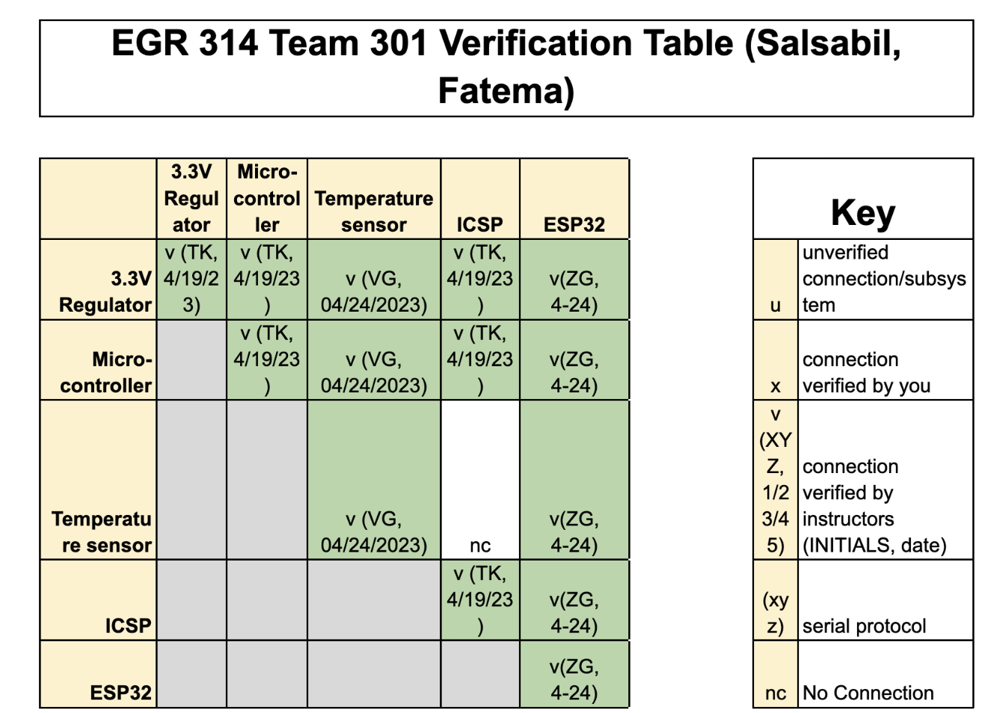

# **8.0 System Verification **

<figure class="image">  

  

   

Figure 19 - Verification Table  

</figure>

Our next step was to verify the function of our design and get our verification table verified. 
The table above shows that all 5 components have been tested and verified to be in proper working condition.
This table is an essential tool used to ensure that all systems are fully functional and meet the necessary requirements.
Each subsystem has been rigorously tested to confirm that it is operating according to the predetermined specifications. 
The verification process provides peace of mind to the engineers and designers who have worked on the project by ensuring that the system is functioning as intended. 
The table presents a clear overview of the testing results, indicating which subsystems have passed the tests and been verified by the teaching team. 

Overall, the verification table is an invaluable resource for ensuring that all components of the system are performing optimally, leading to a reliable and efficient system.
